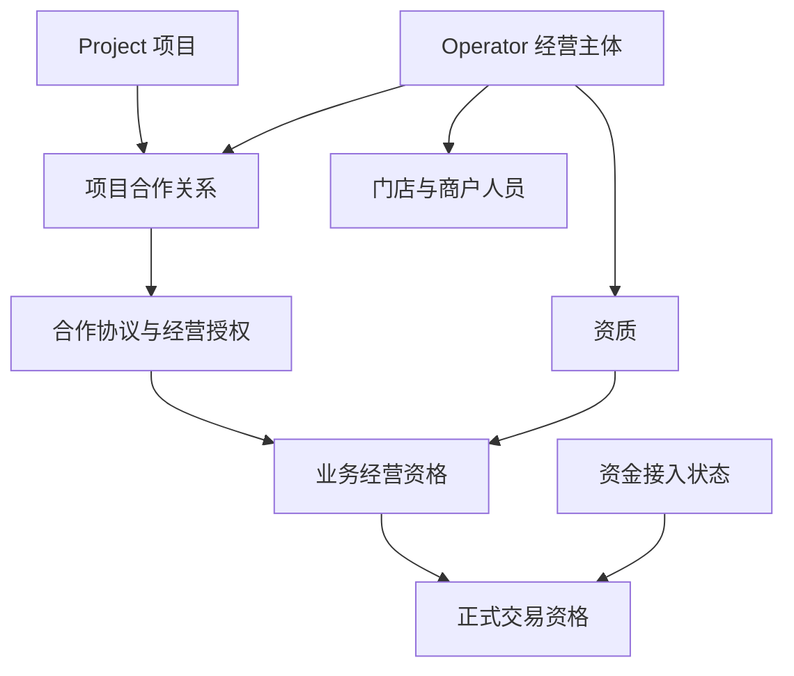
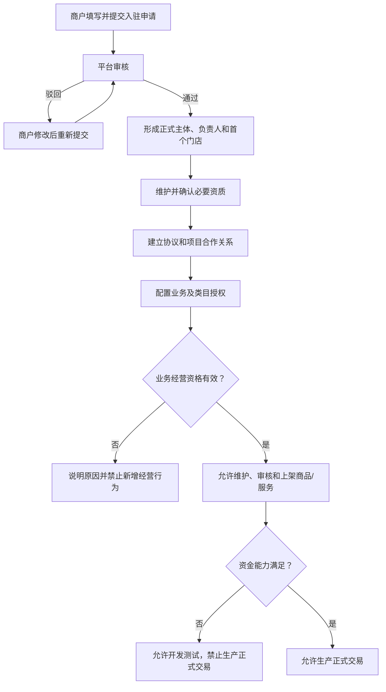
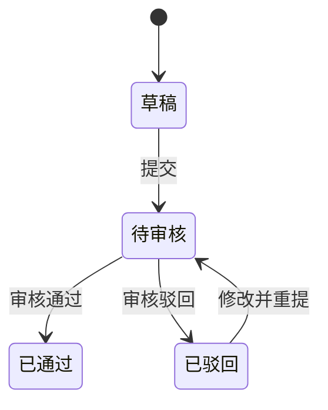

# 大光路智慧社区数字化运营平台 V1.0

# 01｜平台基础模型、商户入驻与合作关系产品需求详细设计

> 文档版本：V1.2  
> 编制日期：2026-09-01  
> 适用范围：大光路智慧社区数字化运营平台 V1.0 一期  
> 主要读者：产品、研发、测试、业务运营、前端原型生成工具  
> 对应终端：管理后台 Web、商户小程序

## 1. 需求背景

### 1.1 业务背景

大光路智慧社区数字化运营平台一期同时建设社区商城和社区服务。商品或服务进入平台经营前，需要先明确经营主体是谁、在哪个社区项目经营、依据什么合作、允许经营哪些业务和类目，以及当前是否具备经营与正式交易条件。

一期先在大光路社区落地，但基础模型不能写死为单一社区。系统需要将 Project（运营项目）作为业务归属和数据权限的重要维度，并将入驻申请、正式经营主体、门店、人员、资质、协议、项目合作、经营授权和经营资格拆分管理，为后续商城、社区服务及支付分账提供统一前置条件。

### 1.2 建设目标

1. 建立可复用的项目档案、项目上下文和项目数据范围；
2. 建立商户、服务机构统一的经营主体档案；
3. 跑通“申请—审核—正式建档—合作—授权—经营”的主链路；
4. 管理经营主体下属门店、人员及分业务资质；
5. 通过轻量合作协议记录合作依据，不建设复杂合同平台；
6. 分别回答“在哪个项目合作”和“允许经营什么”；
7. 将业务经营资格与正式交易资格分开判断、分开解释；
8. 为商城、社区服务、支付分账等后续专题提供稳定的业务边界。

### 1.3 本次范围

| 范围 | 本次建设内容 |
|---|---|
| 平台基础 | Project 档案、项目切换、项目数据权限 |
| 商户准入 | 入驻草稿、提交、审核、驳回重提、审核通过建档 |
| 经营主体 | 主体档案、生命周期、联系人、门店、商户人员 |
| 资质 | 主体/人员资质、有效期、适用业务及类目、到期处理 |
| 合作管理 | 轻量合作协议、项目合作关系、项目经营授权 |
| 资格管理 | 业务经营资格、资金接入状态、正式交易资格及原因解释 |
| 公共支撑 | 附件引用、消息提醒、操作日志、数据权限和隐私展示 |
| 终端页面 | 管理后台 Web；商户小程序入驻、资料和状态页面 |

### 1.4 本次不包含

- 商品、SKU、库存、商城订单及履约详细设计；
- 社区服务项目、预约、服务订单及履约详细设计；
- 微信支付、分账接收方、分账规则、回退、解冻和对账具体设计；
- 合同模板、复杂审批、电子签章和完整合同生命周期；
- 商户 PC 经营工作台、管理端作业小程序；
- 多级分账、商户钱包、自动提现；
- 个人服务者在线收款或资金托管；
- 社区活动、空间资源、物业工单及课题创新点。

本专题只保留资金接入状态和佣金/分账规则引用，不保存微信渠道参数，也不执行支付或分账。

## 2. 整体业务设计

### 2.1 参与角色

| 角色 | 主要职责 | 主要使用端 |
|---|---|---|
| 系统管理员 | 项目、账号、角色及全局数据管理 | Web |
| 平台运营管理员 | 商户、协议、合作、授权和经营状态管理 | Web |
| 商户审核人员 | 审核入驻资料和资质 | Web |
| 项目运营人员 | 管理本人负责项目内的商户合作关系 | Web |
| 商户负责人 | 申请入驻，维护主体允许项、门店和人员 | 商户小程序 |
| 商户工作人员 | 按角色及门店范围查看或维护资料 | 商户小程序 |
| 服务人员 | 作为商户人员的一类身份，供后续履约使用 | 商户小程序；本专题仅建立关系 |

### 2.2 核心业务对象

| 业务对象 | 业务定义 | 与其他对象关系 |
|---|---|---|
| Project（项目） | 独立运营和数据归属的社区项目 | 关联合作关系、协议、授权及项目业务数据 |
| Member（自然人用户） | 使用微信小程序的自然人身份 | 通过商户人员关系归属经营主体 |
| OperatorApplication（入驻申请） | 审核通过前的申请资料及审核历史 | 通过后生成或关联正式经营主体 |
| Operator（经营主体） | 在平台经营商品或提供服务的法定/经营主体 | 下设门店、人员、资质，并参与项目合作 |
| Store（门店） | 经营主体下的经营场所或履约场所 | 不独立取得主体级经营资格 |
| MerchantStaff（商户人员关系） | 自然人与经营主体之间的角色及门店范围 | 决定商户端身份和数据范围 |
| Qualification（资质） | 主体或人员具备某类业务能力的凭证 | 按业务及类目参与资格判断 |
| CooperationAgreement（合作协议） | 平台与商户合作的业务依据 | 关联项目、主体和合作范围 |
| ProjectCooperation（项目合作关系） | 某主体在某项目内的合作生命周期 | 承载该项目下的经营授权 |
| ProjectAuthorization（经营授权） | 允许经营的业务、类目、门店范围和期限 | 受合作关系及协议范围约束 |
| BusinessQualification（业务经营资格） | 是否允许发布、审核和上架指定商品/服务 | 由主体、资质、协议、合作和授权共同决定 |
| FundAccessStatus（资金接入状态） | 支付与分账能力的接入结果 | 由支付分账专题同步，本专题只读 |
| FormalTradeQualification（正式交易资格） | 是否允许生产环境创建正式付款交易 | 由业务经营资格与资金能力共同决定 |

### 2.3 核心对象关系



对象职责口径：Operator 回答“是谁”；合作协议回答“为什么合作”；项目合作回答“在哪个项目合作”；经营授权回答“允许经营什么”；业务经营资格回答“是否可以开展业务”；资金接入状态回答“资金能力是否接通”；正式交易资格回答“生产环境是否允许正式交易”。

### 2.4 总体业务流程



### 2.5 总体业务规则

| 编号 | 规则 |
|---|---|
| BR-01 | Project 不等同于 Tenant。Project 表示业务运营项目，所有项目业务必须保存明确项目归属 |
| BR-02 | 入驻申请与正式经营主体分离；审核通过后才形成或关联正式主体 |
| BR-03 | 同一经营主体不得因多次申请或进入多个项目重复建档；组织主体以统一社会信用代码为主要去重依据 |
| BR-04 | 门店不是独立经营资格主体；资格按“项目 + 经营主体 + 业务类型 + 可选类目”判断 |
| BR-05 | 审核通过只代表主体准入，不自动获得经营权；仍须满足协议、合作、授权和必要资质 |
| BR-06 | 授权范围和期限不得超过项目合作及依据协议的范围和期限 |
| BR-07 | 资质按适用业务和类目影响资格，不以任一资质过期使全部业务停业 |
| BR-08 | 商品/服务草稿可只校验主体身份；提交审核和上架必须校验业务经营资格 |
| BR-09 | 生产环境创建付款交易前必须校验正式交易资格 |
| BR-10 | 资金未接通不阻塞准入、合作授权及商品/服务开发测试，可使用 Mock 支付 |
| BR-11 | 主体、协议、合作或授权失效后禁止新增经营行为；历史订单仍允许必要履约、售后、退款和资金处理 |
| BR-12 | 资金异常不改变主体审核状态，也不直接改变业务经营资格 |
| BR-13 | 不使用单一“商户状态”代替主体、合作、授权、资金等独立状态；无效结果必须可解释 |
| BR-14 | 跨项目和跨商户访问按登录用户权限校验，前端参数不得扩大数据范围 |

两层资格口径：

```text
主体审核通过 + 主体正常 + 必要资质有效 + 协议有效
+ 项目合作有效 + 对应业务及类目授权有效
= 业务经营资格有效

业务经营资格有效 + 资金接入满足 + 必要分账关系有效
= 正式交易资格具备
```

## 3. 功能与页面结构

### 3.1 功能/菜单结构

```text
管理后台 Web
├─ 平台管理
│  └─ 4.1 项目管理
├─ 运营主体
│  ├─ 4.3 入驻审核
│  ├─ 4.4 商户管理
│  ├─ 4.6 门店管理
│  ├─ 4.8 商户人员
│  └─ 4.10 资质管理
└─ 合作管理
   ├─ 4.12 合作协议
   ├─ 4.13 项目合作关系
   ├─ 4.14 项目经营授权
   └─ 4.15 商户经营状态

商户小程序｜我的｜商户资料
├─ 4.2 入驻申请
├─ 4.16 审核结果
├─ 4.5 基本资料
├─ 4.7 门店资料
├─ 4.9 商户人员
├─ 4.11 资质
├─ 4.17 合作状态
└─ 4.18 经营资格
```

上述编号同时作为 3.2 页面清单编号和第 4 章功能详细设计编号。一个编号只对应一个菜单或页面；同一业务在 Web 与小程序均有页面时分别编号，小程序章节通过引用 Web 章节复用公共业务规则。

### 3.2 页面清单

| 编号 | 端 | 功能/页面 | 页面用途 | 使用角色 | 核心操作 |
|---|---|---|---|---|---|
| 4.1 | Web | 项目管理 | 管理项目档案、状态和项目上下文 | 系统管理员 | 新增、编辑、启停、切换 |
| 4.2 | 商户小程序 | 入驻申请 | 分步填写并提交商户申请 | 商户负责人 | 保存草稿、提交、驳回后重提 |
| 4.3 | Web | 入驻审核 | 审核商户申请材料 | 审核人员 | 通过、驳回、查看历史 |
| 4.4 | Web | 商户管理 | 管理正式经营主体档案和生命周期 | 运营、审核人员 | 查询、详情、修改允许项、暂停、恢复、退出 |
| 4.5 | 商户小程序 | 基本资料 | 查看正式主体并维护非核心资料 | 商户负责人 | 查看、编辑允许项 |
| 4.6 | Web | 门店管理 | 管理经营及履约场所 | 运营人员 | 新增、编辑、停用、恢复 |
| 4.7 | 商户小程序 | 门店资料 | 商户维护所属主体门店 | 商户负责人/工作人员 | 查看、新增、编辑、停用 |
| 4.8 | Web | 商户人员 | 管理人员身份、角色和门店范围 | 运营人员 | 邀请、调整、停用、负责人转交 |
| 4.9 | 商户小程序 | 商户人员 | 商户负责人管理人员关系 | 商户负责人 | 邀请、调整、停用、负责人转交 |
| 4.10 | Web | 资质管理 | 管理资质及适用范围 | 运营、审核人员 | 新增、更新、确认、标记无效 |
| 4.11 | 商户小程序 | 资质 | 商户提交和维护资质材料 | 商户负责人 | 新增、更新、查看结果 |
| 4.12 | Web | 合作协议 | 记录轻量合作依据 | 运营人员 | 新增、生效、终止、查看 |
| 4.13 | Web | 项目合作关系 | 管理主体与项目的合作周期 | 运营人员 | 建立、暂停、恢复、终止 |
| 4.14 | Web | 项目经营授权 | 配置业务、类目、门店和期限 | 运营人员 | 新增、编辑、暂停、恢复、终止 |
| 4.15 | Web | 商户经营状态 | 汇总业务及交易资格和原因 | 运营、审核人员 | 查询、穿透、重新核对 |
| 4.16 | 商户小程序 | 审核结果 | 查看申请进度、意见及驳回原因 | 商户负责人 | 查看、进入修改重提 |
| 4.17 | 商户小程序 | 合作状态 | 查看协议、项目合作和经营授权 | 商户人员 | 只读查看 |
| 4.18 | 商户小程序 | 经营资格 | 查看业务资格、资金状态和交易资格 | 商户人员 | 查看原因和处理入口 |

### 3.3 核心操作路径

```text
商户进入项目邀请入口
→ 4.2 入驻申请：保存并提交
→ 4.3 入驻审核：平台通过或驳回
→ 4.4/4.6/4.8：生成正式主体、负责人和首个门店
→ 4.10 资质管理：确认必要资质
→ 4.12/4.13：建立合作协议与项目合作关系
→ 4.14 项目经营授权：配置商城/社区服务及类目范围
→ 4.15 商户经营状态：核对业务经营资格
→ 商品/服务维护、审核和上架
→ 资金接入完成后开放生产正式交易
```

## 4. 功能详细设计

### 4.1 项目管理（Web）

#### 4.1.1 功能概述与业务对象

项目管理用于维护平台可运营的 Project，并通过管理后台顶部项目切换器确定当前业务上下文。项目切换后，查询、统计、新建业务默认值和经营资格判断同步切换。

| 业务对象 | 本功能中的作用 | 创建/更新时机 | 关联对象 |
|---|---|---|---|
| Project | 记录项目档案及生命周期 | 管理员创建、编辑、启停 | 协议、合作、授权及项目业务 |
| 用户项目权限 | 决定可选择、可访问的项目 | 账号授权变化时 | 系统账号与角色 |

#### 4.1.2 字段设计

| 字段 | 控件/展示 | 数据来源 | 必填 | 默认值 | 可编辑条件 | 校验/规则 |
|---|---|---|:---:|---|---|---|
| 项目编码 | 输入框/只读 | 管理员 | 是 | 无 | 创建时 | 2—32字符，全局唯一，创建后锁定 |
| 项目名称 | 输入框 | 管理员 | 是 | 无 | 草稿/启用 | 2—50字符 |
| 项目类型 | 下拉 | 字典 | 是 | 社区 | 草稿/启用 | 一期至少支持“社区” |
| 运营组织 | 组织选择 | 组织档案 | 是 | 当前组织 | 有权限时 | 必须为有效组织 |
| 开始日期 | 日期 | 管理员 | 否 | 空 | 可编辑 | 不得晚于结束日期 |
| 结束日期 | 日期 | 管理员 | 否 | 空 | 可编辑 | 空表示长期；到期不删除数据 |
| 项目状态 | 标签 | 系统 | 是 | 草稿 | 状态操作 | 草稿/启用/停用 |
| 备注 | 多行文本 | 管理员 | 否 | 空 | 可编辑 | 最多500字 |

#### 4.1.3 数据规则与状态流转

- 项目编码全局唯一，项目被业务引用后不允许删除；
- 项目停用只阻止新增业务，不删除历史数据，也不自动终止历史订单；
- 新建协议、合作和授权默认带入当前项目，保存时仍须校验用户是否拥有该项目权限；
- 普通项目人员只有一个项目权限时，项目选择器锁定该项目。

| 当前状态 | 触发操作 | 操作角色 | 前置条件 | 下一状态 | 业务结果 |
|---|---|---|---|---|---|
| 草稿 | 启用 | 系统管理员 | 必填完整、编码唯一 | 启用 | 可作为业务上下文 |
| 启用 | 停用 | 系统管理员 | 二次确认影响 | 停用 | 禁止新增协议、合作、授权和经营行为 |
| 停用 | 恢复 | 系统管理员 | 项目仍可运营 | 启用 | 恢复新增业务能力 |

#### 4.1.4 页面、交互与前后端规则

查询区支持项目名称/编码模糊查询，按项目类型和状态精确筛选；列表展示编码、名称、类型、运营组织、起止日期、状态和操作。编码点击进入详情，空结束日期显示“长期”。

| 操作 | 展示/可用条件 | 前端交互 | 系统业务处理 | 失败反馈 |
|---|---|---|---|---|
| 新增 | 有新增权限 | 表单提交、防重复点击 | 校验编码和组织后保存草稿 | 定位具体字段错误 |
| 编辑 | 有编辑权限 | 回显表单 | 保存允许项并记录变更 | 数据已变化时提示刷新 |
| 停用/恢复 | 对应状态且有权限 | 二次确认并说明影响 | 变更状态、记录原因并联动业务入口 | 未满足条件时说明原因 |
| 切换项目 | 用户有多个项目 | 顶部选择器 | 校验权限后刷新当前页数据 | 无权限时拒绝切换 |

前端完成必填、长度、日期先后及防重复提交校验；后端重新校验编码唯一、组织有效、当前状态和项目权限。

#### 4.1.5 权限、关联与验收

系统管理员可管理全部项目；运营人员只可查看授权项目；项目运营人员不可通过修改页面参数访问其他项目。项目状态供协议、合作、授权、商城和服务作为新增业务前置条件。

验收标准：项目可独立于 Tenant 建立；切换项目后查询和新增默认值同步变化；停用后历史可查但不能新增项目业务；未授权项目的页面与直接请求均访问失败。

### 4.2 入驻申请（商户小程序）

#### 4.2.1 功能概述与业务流程

商户负责人在小程序分步填写并提交入驻申请。申请审核通过前始终属于申请记录；审核处理规则见 4.3“入驻审核”。



| 业务对象 | 本功能中的作用 | 创建时机 | 更新时机 | 关联对象 |
|---|---|---|---|---|
| 入驻申请 | 保存每次申请材料与当前状态 | 首次保存 | 草稿修改、提交、审核 | 项目、申请人 |
| 审核记录 | 固化每次审核意见与结果 | 审核提交时 | 不修改 | 入驻申请、审核人 |
| 经营主体 | 审核通过后的正式主体 | 首次通过时 | 已有主体核对后关联/更新允许项 | 门店、人员、资质 |

#### 4.2.2 申请字段设计

申请步骤：主体信息 → 联系人 → 资质 → 门店信息 → 确认提交。

| 字段 | 控件/展示 | 数据来源 | 必填 | 默认值 | 可编辑条件 | 校验/规则 |
|---|---|---|:---:|---|---|---|
| 主体类型 | 单选卡片 | 商户 | 是 | 无 | 草稿/已驳回 | 企业/机构、个体工商户；个人服务者后置 |
| 主体名称 | 输入框 | 商户 | 是 | 无 | 草稿/已驳回 | 2—100字符，与证照一致 |
| 统一社会信用代码 | 输入框/识别辅助 | 商户 | 组织必填 | 无 | 草稿/已驳回 | 18位格式；提交时全局查重 |
| 法定代表人/经营者 | 输入框 | 商户 | 组织必填 | 无 | 草稿/已驳回 | 与证照一致 |
| 注册地址 | 地址输入 | 商户 | 否 | 空 | 草稿/已驳回 | 最多200字 |
| 联系人姓名 | 输入框 | 商户 | 是 | 当前用户姓名 | 草稿/已驳回 | 2—30字符 |
| 联系手机号 | 手机号输入 | 商户 | 是 | 当前账号手机号 | 草稿/已驳回 | 11位手机号，必要时验证 |
| 营业执照 | 文件上传 | 商户 | 是 | 无 | 草稿/已驳回 | 支持预览和替换 |
| 其他资质 | 资质卡片 | 商户 | 依类目 | 无 | 草稿/已驳回 | 填写类型、编号、有效期、附件 |
| 首个门店名称 | 输入框 | 商户 | 是 | 无 | 草稿/已驳回 | 2—50字符 |
| 门店地址 | 定位+文本 | 商户 | 是 | 无 | 草稿/已驳回 | 保留详细地址，经纬度可选 |
| 营业时间 | 时间段/文本 | 商户 | 否 | 空 | 草稿/已驳回 | 一期采用每日统一时段或文本 |
| 申请项目 | 只读 | 邀请入口 | 是 | 当前项目 | 不可编辑 | 用户须有有效邀请/入口 |
| 经营业务 | 多选 | 商户 | 是 | 无 | 草稿/已驳回 | 商城、社区服务，仅为申请意向 |
| 申请类目 | 级联多选 | 类目 | 是 | 无 | 草稿/已驳回 | 供审核和后续授权参考 |

#### 4.2.3 数据规则与状态流转

- 草稿可自动保存，未完成必填项不阻止保存；提交时一次性校验全部必填项；
- 待审核申请锁定，商户不可修改；一期不提供主动撤回；
- 驳回后在同一申请上修订并重新提交，保留各次提交内容和审核历史；
- 审核通过后申请内容固化，不因后续主体资料变更被覆盖；
- 信用代码已有正式主体时不重复建档，转平台人工核对主体归属；
- 同一申请重复提交或多人同时审核，仅第一项有效操作生效。

| 当前状态 | 可编辑 | 可提交 | 可审核 | 下一步 |
|---|:---:|:---:|:---:|---|
| 草稿 | 是 | 是 | 否 | 提交后待审核 |
| 待审核 | 否 | 否 | 是 | 通过或驳回 |
| 已驳回 | 是 | 是 | 否 | 修改后重提 |
| 已通过 | 否 | 否 | 否 | 转正式主体资料 |

#### 4.2.4 页面、交互与后端规则

小程序使用步骤式表单，显示完成进度、上一步、下一步、保存草稿和提交。草稿和已驳回状态允许编辑；待审核和已通过状态只读，并引导进入 4.16“审核结果”。

| 操作 | 条件 | 前端交互 | 系统业务处理 | 结果 |
|---|---|---|---|---|
| 保存草稿 | 草稿/已驳回 | 自动或手动保存 | 校验已填字段格式，保留当前步骤和最近保存时间 | 返回保存结果 |
| 提交 | 必填完整 | 确认提交、防重复点击 | 校验状态、重复主体和项目入口，固化本次材料，生成审核待办 | 变为待审核 |
| 修改重提 | 已驳回 | 回显上次资料并展示驳回原因 | 保留原审核记录，保存修订后的新提交版本 | 重新变为待审核 |

异常反馈：审核中修改提示“申请审核中，暂不可修改”；重复主体提示“该主体可能已入驻，请联系平台”；重复提交只接受首次有效操作。

#### 4.2.5 权限、关联与验收

商户负责人只可维护本人发起或本人负责主体的申请。提交后联动 4.3“入驻审核”和消息提醒。

验收标准：草稿可保存；必填项不完整时不能提交；提交后锁定；驳回后可回显原因和资料并重提；重复提交和重复主体得到正确处理；各次提交内容完整保留。

### 4.3 入驻审核（Web）

#### 4.3.1 功能概述与业务对象

入驻审核供审核人员处理 4.2 提交的申请。申请字段、状态定义及主体唯一性规则与 4.2 相同，本节只补充 Web 审核页面和审核操作规则。

| 业务对象 | 本功能中的作用 | 创建/更新时机 | 关联对象 |
|---|---|---|---|
| 入驻申请 | 提供本次待审核材料 | 商户提交后进入待审核 | 项目、申请人 |
| 审核记录 | 固化审核结果、意见和审核人 | 每次通过或驳回时创建 | 入驻申请 |
| 正式经营主体及首店、负责人 | 审核通过后的业务结果 | 首次审核通过时创建或关联 | 经营主体、门店、人员 |

#### 4.3.2 页面与操作规则

审核页分为申请摘要、主体信息、联系人、证照资质、门店资料、申请业务、附件、历史提交、审核记录和审核意见。字段只读，审核人员不能直接替商户修改申请材料。

| 操作 | 展示/可用条件 | 前端交互 | 系统业务处理 | 成功结果 |
|---|---|---|---|---|
| 审核通过 | 待审核且资料完整 | 二次确认，可填写意见 | 校验状态、项目权限和主体唯一性；保存审核记录；创建或关联主体、负责人和首店 | 申请变为已通过并通知商户 |
| 审核驳回 | 待审核 | 驳回原因必填 | 保存驳回原因和审核记录 | 申请变为已驳回并通知商户 |
| 查看历史 | 有查看权限 | 时间线展示 | 读取历次提交和审核快照 | 只读查看 |

#### 4.3.3 后端、权限、异常与验收

系统按“校验申请状态 → 校验项目和审核权限 → 校验主体重复 → 固化审核结果 → 形成关联对象 → 记录日志并通知”的顺序处理。任何一步失败不得形成不完整的主体、首店或负责人关系。

审核人员只能处理授权项目申请；项目运营人员是否拥有审核按钮由角色权限配置。两人同时审核时只允许第一项有效操作成功，后操作人提示“申请状态已变化”；驳回原因为空时阻止提交；发现已有主体时转人工核对，不重复建档。

验收标准：审核材料完整可追溯；通过和驳回按钮条件正确；通过后形成唯一主体、有效负责人和首店；驳回原因回传小程序；并发审核和重复主体得到正确处理。

### 4.4 商户管理（Web）

#### 4.4.1 功能概述与业务对象

经营主体档案统一管理商户或服务机构的正式身份及生命周期。商户列表同时展示主体、合作、业务资格和资金状态，但不得合并为一个笼统“商户状态”。

| 业务对象 | 作用 | 生成时机 | 更新时机 | 历史原则 |
|---|---|---|---|---|
| 经营主体 | 唯一正式经营身份 | 入驻通过或后台核对已有主体 | 联系人维护、核心资料变更、状态操作 | 不物理删除 |
| 主体变更记录 | 记录核心字段前后值 | 核心资料变更时 | 不修改 | 永久保留 |

#### 4.4.2 字段设计

| 字段 | 控件/展示 | 来源 | 必填 | 默认值 | 可编辑条件 | 校验/规则 |
|---|---|---|:---:|---|---|---|
| 主体编码 | 只读 | 系统 | 是 | 自动生成 | 不可编辑 | 全局唯一 |
| 主体类型 | 标签 | 入驻申请 | 是 | 无 | 审核后锁定 | 企业/机构、个体工商户 |
| 主体名称 | 文本 | 入驻申请 | 是 | 无 | 核心资料变更 | 与证照一致 |
| 统一社会信用代码 | 脱敏文本 | 入驻申请 | 组织必填 | 无 | 审核后锁定 | 全局去重 |
| 法定代表人/经营者 | 文本 | 入驻申请 | 组织必填 | 无 | 核心资料变更 | 后台按权限完整展示 |
| 主要联系人 | 输入框 | 商户/后台 | 是 | 申请联系人 | 正常状态 | 2—30字符 |
| 联系手机号 | 脱敏/输入 | 商户/后台 | 是 | 申请手机号 | 正常状态 | 手机号格式 |
| 注册地址 | 文本 | 入驻申请 | 否 | 空 | 有权限时 | 最多200字 |
| 主体状态 | 标签 | 状态操作 | 是 | 正常 | 专用操作 | 正常/暂停/退出 |
| 建档时间 | 日期时间 | 系统 | 是 | 自动 | 不可编辑 | 精确到分钟 |

#### 4.4.3 数据、状态和页面规则

同一信用代码只能对应一个有效主体；主体被任何项目或历史业务引用后不可物理删除。核心法定字段一期仅允许 Web 有权限人员修改并记录前后值，商户小程序提示联系平台；联系人等非核心字段可由商户负责人维护。

| 当前状态 | 操作 | 前置条件 | 下一状态 | 业务结果 |
|---|---|---|---|---|
| 正常 | 暂停 | 填写原因并确认影响 | 暂停 | 禁止新发布、上架和交易，历史业务保留 |
| 暂停 | 恢复 | 风险/整改原因已消除 | 正常 | 重新核对各项目资格 |
| 正常/暂停 | 退出 | 确认合作及未完事项 | 退出 | 永久禁止新增经营行为，不可恢复 |

商户详情包含基础信息、门店、商户人员、资质、合作协议、项目合作与授权、经营资格、操作记录等 Tab。顶部并列展示主体状态、入驻结果、业务经营资格、资金状态和正式交易资格及原因。

查询支持当前项目、名称/编码、主体类型、主体状态、入驻结果、业务资格、资金状态和交易资格；列表手机号和信用代码脱敏，点击主体名称进入详情。

暂停、恢复和退出必须二次确认；系统重新校验状态，保存原因，联动资格结果并记录日志。退出前若存在未结束订单，只提示并要求确认，不删除或阻断必要履约、售后和退款。

#### 4.4.4 权限、关联、异常与验收

系统管理员可访问全部主体；运营及审核人员按项目范围访问；商户负责人只访问所属主体。无权查看完整证件或敏感字段时展示脱敏值。

主体状态供商城、服务和资格功能使用。若主体资料在操作期间已变化，保存失败并提示刷新；信用代码冲突时阻止保存；主体退出后再次操作提示“主体已退出，不支持新增经营行为”。

验收标准：主体唯一且不可物理删除；不同状态下按钮正确；暂停/退出只影响新增经营行为；核心变更可追溯；各角色只能访问自身数据范围。

### 4.5 基本资料（商户小程序）

#### 4.5.1 功能概述与复用规则

本页面展示商户审核通过后的正式经营主体资料。主体对象、字段含义、唯一性、生命周期、历史保留及异常处理均与 4.4“商户管理”相同，本节不重复定义。

#### 4.5.2 小程序端差异

- 商户负责人可修改主要联系人、联系电话等非核心字段；
- 主体名称、信用代码、法定代表人/经营者等核心字段只读，提示“如需变更请联系平台”；
- 普通工作人员只读；敏感字段按角色脱敏；
- 主体暂停或退出时，页面顶部展示状态原因和对新增经营行为的影响；
- 若一个自然人属于多个主体，进入页面前必须先明确当前主体。

验收标准：小程序展示内容与 4.4 主体详情一致；非核心字段修改同步回 Web；核心字段无编辑入口；跨主体访问失败。

### 4.6 门店管理（Web）

#### 4.6.1 功能概述与业务对象

门店表示经营主体下的经营或履约场所，不是独立经营资格主体。

| 业务对象 | 创建时机 | 更新时机 | 失效方式 | 关联对象 |
|---|---|---|---|---|
| 门店 | 入驻通过生成首店或后续新增 | 资料编辑、停用、恢复 | 停用 | 主体、授权、商品/服务 |

#### 4.6.2 字段设计

| 字段 | 控件/来源 | 必填 | 可编辑条件 | 校验/规则 |
|---|---|:---:|---|---|
| 门店名称 | 输入框 | 是 | 正常状态 | 2—50字符，同主体内建议不重复 |
| 所属主体 | 选择/只读 | 是 | 创建时 | 创建后不可更换 |
| 地址 | 定位+文本 | 是 | 正常状态 | 保留详细地址；经纬度可空 |
| 联系人 | 输入框 | 是 | 正常状态 | 2—30字符 |
| 联系电话 | 手机/座机 | 是 | 正常状态 | 格式校验，列表脱敏 |
| 营业时间 | 时间/文本 | 否 | 正常状态 | 一期轻量配置 |
| 状态 | 标签 | 是 | 状态操作 | 正常/停用 |

#### 4.6.3 数据、页面与后端规则

门店被历史业务引用后不物理删除；停用后不再用于新商品经营、服务履约或自提，历史订单保留门店快照；停用单个门店不直接使主体整体资格无效。

页面按项目、商户、门店名称和状态查询，展示地址、联系人脱敏信息、营业时间和状态。新增、编辑、停用和恢复均校验项目、主体、操作者权限及最新状态；停用需二次确认影响。

#### 4.6.4 权限、关联、异常与验收

运营人员按项目管理门店；审核人员按权限查看。门店向授权、商城和服务提供有效经营/履约场所。主体已暂停/退出时不允许新增门店；重复停用提示状态已变化。

验收标准：门店资料可维护；停用后不出现在新业务选择项；历史数据不丢失；跨项目或跨主体访问失败。

### 4.7 门店资料（商户小程序）

门店对象、字段、数据生命周期、停用影响和异常规则与 4.6“门店管理”相同。本页面仅允许商户负责人或具有门店维护权限的工作人员管理所属主体、授权范围内的门店；所属主体只读，列表默认仅显示有权访问的门店。新增、编辑、停用和恢复结果实时同步 Web。

验收标准：页面字段和状态与 4.6 一致；工作人员不能访问未授权门店；停用操作二次确认；修改结果在 Web 可见。

### 4.8 商户人员（Web）

#### 4.8.1 功能概述与业务对象

商户人员关系表示自然人在经营主体内的身份、角色及门店范围，是商户端权限判断依据。

| 业务对象 | 创建时机 | 更新时机 | 失效方式 | 关联对象 |
|---|---|---|---|---|
| 商户人员关系 | 审核通过生成负责人或邀请确认 | 角色、门店范围调整 | 停用 | Member、主体、门店 |

#### 4.8.2 字段设计

| 字段 | 控件/来源 | 必填 | 可编辑条件 | 校验/规则 |
|---|---|:---:|---|---|
| 关联用户 | 手机号搜索/邀请 | 是 | 创建时 | 对应有效自然人 |
| 所属主体 | 只读 | 是 | 不可编辑 | 来自当前主体 |
| 人员角色 | 选择 | 是 | 有权人员 | 负责人、工作人员、服务人员 |
| 门店范围 | 多选 | 否 | 有权人员 | 空表示主体下全部有效门店 |
| 人员状态 | 标签 | 是 | 状态操作 | 在职/停用 |

#### 4.8.3 数据、页面与后端规则

人员关系被历史记录引用后不物理删除；停用后立即失去商户端权限。不得直接停用最后一名有效负责人，应先转交负责人。同一自然人可归属多个主体，但每次操作必须使用明确主体上下文。

列表展示姓名、手机号脱敏值、角色、门店范围、状态和加入时间。邀请时校验自然人、主体、重复关系和操作者权限；邀请确认后生效。角色或范围调整后立即更新数据权限并记录日志。

#### 4.8.4 权限、关联、异常与验收

运营人员按项目管理；审核人员只读。人员关系向登录权限和后续履约提供身份。重复邀请提示已有关系；最后负责人停用被阻止；并发调整以最新状态校验。

验收标准：邀请和角色调整有效；人员停用即时失权；最后负责人受保护；跨主体和跨门店越权失败；历史记录保留。

### 4.9 商户人员（商户小程序）

人员对象、字段、邀请确认、角色和门店范围、停用及负责人保护规则与 4.8“商户人员”相同。小程序只允许商户负责人管理所属主体人员；普通工作人员只查看本人身份与范围，不显示人员管理按钮。负责人转交时必须选择已确认加入且在职的人员。

验收标准：页面数据与 4.8 一致；邀请、调整和停用同步 Web；普通工作人员无管理权限；最后负责人不能直接停用。

### 4.10 资质管理（Web）

#### 4.10.1 功能概述与业务对象

资质管理记录主体或人员具备某类经营/服务能力的凭证，并按适用业务及类目参与业务经营资格判断。

| 业务对象 | 创建时机 | 更新时机 | 历史规则 | 关联对象 |
|---|---|---|---|---|
| 资质 | 入驻申请带入或后续新增 | 确认、续期、附件/范围变更 | 保留变更和旧附件记录 | 主体/人员、业务、类目 |

#### 4.10.2 字段设计

| 字段 | 控件/展示 | 来源 | 必填 | 默认值 | 可编辑条件 | 校验/规则 |
|---|---|---|:---:|---|---|---|
| 资质类型 | 字典下拉 | 配置 | 是 | 无 | 新增时 | 如营业执照、食品经营许可证、人员资格证 |
| 持有人类型/持有人 | 选择器 | 主体/人员 | 是 | 当前主体 | 新增时 | 人员须属于当前主体 |
| 证件编号 | 输入框 | 商户/后台 | 依类型 | 无 | 待确认/有效 | 按类型配置格式和唯一性 |
| 生效/失效日期 | 日期 | 商户/后台 | 依类型 | 空 | 有权编辑 | 生效日不晚于失效日 |
| 适用业务 | 多选 | 后台确认 | 是 | 申请业务 | 确认/维护 | 商城、社区服务 |
| 适用类目 | 级联多选 | 类目 | 依类型 | 空 | 确认/维护 | 空表示该业务全部授权类目 |
| 证照附件 | 上传 | 文件能力 | 是 | 无 | 有权编辑 | 支持预览和替换 |
| 资质状态 | 标签 | 系统/人工 | 是 | 待确认 | 专用操作 | 待确认/有效/即将到期/已过期/无效 |
| 无效原因 | 文本 | 操作人/系统 | 条件必填 | 空 | 无效时 | 显示在资格原因中 |

#### 4.10.3 状态、页面与后端规则

```text
待确认 → 确认有效 → 有效 → 即将到期 → 已过期
                   └────────→ 人工无效
```

新资质在平台确认前不计入有效资格；临近到期只提醒，不立即失效；到期自动变为已过期；人工无效必须填写原因。续期或范围更新后保留历史并重新核对受影响的业务与类目。

页面支持按商户、持有人、资质类型、业务、状态和到期区间查询；列表展示证件编号脱敏值、有效期、适用范围、状态和操作。详情展示附件、变更记录及影响的经营资格。

系统每日识别临近到期和已到期资质；状态变化后只重新核对其适用业务和类目，不影响无关范围。重复证件、日期非法、持有人无效或附件失效时阻止保存并明确提示。

#### 4.10.4 权限、关联与验收

商户负责人可提交和维护允许状态的资质；审核/运营人员可确认、调整适用范围和标记无效；普通工作人员只读。资质结果向经营资格提供有效性和范围，向消息功能提供到期提醒。

验收标准：食品资质过期只影响食品类目；到期和人工无效均有原因；续期后资格可恢复；历史附件及变更可追溯；无权限人员不能确认或作废资质。

### 4.11 资质（商户小程序）

资质业务对象、字段含义、状态、到期处理、适用业务/类目规则和历史保留规则与 4.10“资质管理”相同。本页面只提供商户侧的新增、更新、附件替换和审核结果查看；适用业务及类目的最终确认、人工无效等平台操作仍在 4.10 完成。

商户负责人可维护所属主体或有权人员的资质；普通工作人员只读。待确认状态应提示“平台确认后生效”；已过期或无效状态展示原因和重新提交入口。

验收标准：小程序提交的资质在 Web 可见；未经平台确认不参与资格判断；状态及原因与 4.10 一致；无权人员不能修改他人或其他主体资质。

### 4.12 合作协议（Web）

#### 4.12.1 功能概述与业务对象

合作协议记录平台与经营主体合作的依据。一期只管理基本信息、签署附件、有效期、合作范围摘要和佣金/分账规则引用，不建设模板审批和电子签。

| 业务对象 | 创建时机 | 更新时机 | 历史规则 | 关联对象 |
|---|---|---|---|---|
| 合作协议 | 运营建立合作依据时 | 草稿编辑、生效、终止、系统到期 | 生效后核心内容不覆盖，变更新建版本 | 项目、主体、合作关系 |

#### 4.12.2 字段设计

| 字段 | 控件/展示 | 来源 | 必填 | 默认值 | 可编辑条件 | 校验/规则 |
|---|---|---|:---:|---|---|---|
| 协议编号 | 输入框/自动生成 | 运营/系统 | 是 | 自动建议 | 草稿 | 当前项目内唯一 |
| 协议名称/版本 | 输入框 | 运营 | 是 | V1.0 | 草稿 | 名称2—100字符；版本变更新建记录 |
| 关联项目 | 项目选择 | 当前上下文 | 是 | 当前项目 | 草稿 | 操作者须有项目权限 |
| 关联商户 | 主体选择 | 正式主体 | 是 | 无 | 草稿 | 主体已通过审核 |
| 平台/商户签约主体 | 选择/只读 | 组织、经营主体 | 是 | 关联主体 | 草稿 | 商户签约主体与经营主体一致 |
| 生效/失效日期 | 日期 | 运营 | 是 | 无 | 草稿 | 生效日早于失效日 |
| 协议附件 | 上传 | 文件能力 | 是 | 无 | 草稿 | 建议仅已签署附件可生效，待确认 |
| 合作经营范围摘要 | 结构化选择+文本 | 运营 | 是 | 无 | 草稿 | 作为授权范围上限 |
| 佣金/分账规则引用 | 选择/文本引用 | 后续专题 | 否 | 空 | 草稿 | 不保存微信参数 |
| 售后等约定摘要 | 多行文本 | 运营 | 否 | 空 | 草稿 | 仅记录业务摘要 |
| 到期提醒天数 | 数字 | 运营 | 否 | 30天 | 草稿/有效 | 正整数 |

#### 4.12.3 状态、页面与后端规则

| 当前状态 | 操作/触发 | 前置条件 | 下一状态 | 业务结果 |
|---|---|---|---|---|
| 草稿 | 生效 | 必填完整、附件和日期合法 | 待生效/有效 | 按日期参与合作判断 |
| 待生效 | 到达生效日 | 项目和主体有效 | 有效 | 可作为合作依据 |
| 有效 | 到期 | 超过失效日 | 已到期 | 停止支持新增经营行为 |
| 有效 | 终止 | 填写原因并确认影响 | 已终止 | 立即停止作为合作依据 |

页面支持按项目、商户、协议名称/编号、状态和到期区间查询；详情展示双方、期限、经营范围、附件、关联合作和操作记录。生效/终止必须二次确认。

系统在生效前校验双方主体、项目、日期、附件和范围；生效后核心内容锁定。协议到期或终止时重新核对相关合作和资格，但不改变历史订单中已固化的协议摘要。并发终止或状态已变化时，后操作被拒绝并提示刷新。

#### 4.12.4 权限、关联与验收

运营人员按项目新增和维护协议；审核人员和商户只读；敏感附件按独立权限查看。协议关联项目合作、经营授权和后续结算规则引用。

验收标准：协议编号唯一；状态按日期正确变化；失效后停止作为新增经营依据；生效后不覆盖核心内容；历史版本、附件和操作可追溯。

### 4.13 项目合作关系（Web）

#### 4.13.1 功能概述与业务对象

项目合作关系描述主体在某个 Project 内是否处于合作期。一个主体可进入多个项目，各项目合作相互独立；具体允许经营的业务和范围由 4.14“项目经营授权”管理。

| 业务对象 | 创建时机 | 更新时机 | 失效方式 | 关联对象 |
|---|---|---|---|---|
| 项目合作关系 | 主体准入并具备协议依据后 | 暂停、恢复、终止、到期 | 暂停/到期/终止 | 项目、主体、协议、经营授权 |

#### 4.13.2 字段设计

| 字段 | 控件/来源 | 必填 | 可编辑条件 | 校验/规则 |
|---|---|:---:|---|---|
| 项目/经营主体 | 选择/当前上下文 | 是 | 创建时 | 同项目同主体不重复建立有效合作 |
| 依据协议 | 协议选择 | 生效必填 | 待生效 | 项目、主体一致且协议有效/待生效 |
| 起止日期 | 日期 | 是 | 待生效 | 位于项目和协议有效期内 |
| 状态/原因 | 标签/文本 | 是/条件必填 | 状态操作 | 待生效、合作中、暂停、到期、终止 |

#### 4.13.3 状态与数据规则

| 当前状态 | 操作/触发 | 下一状态 | 业务结果 |
|---|---|---|---|
| 待生效 | 到达开始日/人工生效 | 合作中 | 下属有效授权可参与资格判断 |
| 合作中 | 暂停 | 已暂停 | 本项目下全部授权暂时无效 |
| 已暂停 | 恢复 | 合作中 | 重新核对授权和资格 |
| 合作中/暂停 | 终止 | 已终止 | 永久停止本项目新增经营行为 |
| 合作中 | 到期 | 已到期 | 停止本项目新增经营行为 |

合作暂停使其下全部授权暂时无效，但不影响同一主体在其他项目的合作。合作被历史业务引用后不物理删除。

#### 4.13.4 页面、交互与后端规则

项目合作页按当前项目、商户、协议、状态和期限查询，可从商户详情穿透。详情展示上游协议、下属授权和资格影响。

| 操作 | 条件 | 前端交互 | 系统业务处理 | 失败反馈 |
|---|---|---|---|---|
| 建立合作 | 主体通过、项目有效 | 选择协议和日期 | 校验项目、主体、协议和重复关系 | 展示具体不满足项 |
| 暂停/终止 | 有效状态 | 填原因、二次确认影响 | 变更状态并重新核对资格 | 状态已变化时提示刷新 |
| 恢复 | 暂停且上游仍有效 | 二次确认 | 重新校验协议、合作期限和资质 | 不满足时列出原因 |

#### 4.13.5 权限、关联、异常与验收

平台/项目运营人员按项目管理，审核人员和商户只读。项目合作向经营授权和资格功能提供合作前置条件。

合作日期超过协议期、主体或协议无效时阻止保存。验收标准：合作状态按期限和操作正确变化；暂停只影响当前项目；终止后不可恢复且历史可查；下属授权同步失效。

### 4.14 项目经营授权（Web）

#### 4.14.1 功能概述与业务对象

经营授权描述在 4.13 项目合作关系下允许经营的业务类型、类目、门店和期限。商城和社区服务分开授权。

| 业务对象 | 创建时机 | 更新时机 | 失效方式 | 关联对象 |
|---|---|---|---|---|
| 经营授权 | 合作关系建立后 | 范围调整、暂停、恢复、终止、到期 | 暂停/到期/终止 | 合作关系、业务类目、门店 |

#### 4.14.2 字段设计

| 字段 | 控件/来源 | 必填 | 可编辑条件 | 校验/规则 |
|---|---|:---:|---|---|
| 项目合作关系 | 选择/只读 | 是 | 创建时 | 必须处于可配置状态 |
| 业务类型 | 单选 | 是 | 创建时 | 商城或社区服务，分开授权 |
| 授权类目 | 级联多选 | 是 | 待生效/有效 | 至少一项且不超过协议范围 |
| 门店范围 | 多选 | 否 | 待生效/有效 | 空表示全部有效门店 |
| 起止日期 | 日期 | 是 | 待生效/有效 | 不超合作和协议期限 |
| 状态/原因 | 标签/文本 | 是/条件必填 | 状态操作 | 待生效、有效、暂停、到期、终止 |

#### 4.14.3 状态与数据规则

| 当前状态 | 操作/触发 | 下一状态 | 业务结果 |
|---|---|---|---|
| 待生效 | 到达开始日 | 有效 | 对应业务和类目可参与资格判断 |
| 有效 | 暂停 | 暂停 | 对应范围资格无效 |
| 暂停 | 恢复 | 有效 | 重新核对资格 |
| 有效/暂停 | 终止/到期 | 终止/到期 | 停止对应范围新增经营行为 |

授权范围变更保留前后值和原因，新范围只影响后续经营判断，不覆盖历史订单快照。上游合作暂停、到期或终止时，授权不参与资格判断。

#### 4.14.4 页面、后端、权限与验收

页面按项目、商户、业务类型、类目、门店和状态查询；新增/编辑时展示上游协议和合作期限，并联动限制可选类目、门店和日期。暂停、恢复和终止均重新校验上游条件、记录原因并更新资格。

平台/项目运营人员按项目管理，审核人员和商户只读。授权超过合作期、超过协议范围、未选类目或选择停用门店时阻止保存。

验收标准：只授权商城不得发布社区服务；只授权商城/生鲜不得上架家电；门店范围正确生效；暂停和恢复联动资格；终止后不可恢复且历史可查。

### 4.15 商户经营状态（Web）

#### 4.15.1 功能概述与业务对象

该功能汇总主体、资质、协议、项目合作、授权和资金状态，形成可解释的业务经营资格与正式交易资格。它不是新的人工审批环节。

| 业务对象 | 数据来源 | 更新时机 | 是否人工修改 |
|---|---|---|:---:|
| 业务经营资格 | 主体、资质、协议、合作、授权 | 任一来源变化后 | 否 |
| 资金接入状态 | 支付分账专题 | 资金配置变化后同步 | 本页面否 |
| 正式交易资格 | 业务资格、资金状态及必要资金关系 | 任一来源变化后 | 否 |

#### 4.15.2 展示字段与数据规则

| 状态维度 | 展示内容 | 穿透入口 |
|---|---|---|
| 主体准入/主体状态 | 已通过、正常等 | 申请或主体详情 |
| 必要资质 | 有效、部分无效及范围 | 资质详情 |
| 合作协议 | 名称、状态、有效期 | 协议详情 |
| 项目合作 | 合作中、暂停等 | 合作详情 |
| 经营授权 | 分业务和类目的状态 | 授权详情 |
| 业务经营资格 | 分商城/服务/类目结果 | 原因抽屉 |
| 资金接入 | 未配置、配置中、可交易、异常 | 支付专题状态页 |
| 正式交易资格 | 具备/未具备 | 原因抽屉 |
| 最近核对时间 | 最近一次结果生成时间 | 无 |

业务资格按“项目 + 主体 + 业务类型 + 可选类目”判断；正式交易资格在其基础上增加资金条件。结果可保存用于列表展示，但正式提交审核、上架或交易前仍须根据最新源数据核对。来源变化后只更新受影响范围。

无效结果至少包含对象类型、对象名称或业务范围、当前状态、失效/到期时间、建议处理入口。例如：

```text
× 食品经营许可证已于 2026-09-30 到期
× 商城/生鲜经营授权已暂停
✓ 主体审核有效
✓ 合作协议有效

正式交易资格未具备：资金接入尚未完成。
```

#### 4.15.3 页面、后端与异常规则

页面按项目、商户、业务类型、业务资格、资金状态和交易资格查询；列表并列展示各状态，点击原因进入抽屉或源详情。商户详情顶部使用同一口径。

以下变化触发重新核对：主体审核或状态变化、资质新增/确认/更新/到期、协议生效/到期/终止、合作变化、授权变化或到期、资金状态变化。用户可手动“重新核对”，但不能直接改结果。

系统按业务顺序读取各来源 → 逐项判断并形成原因 → 保存最近结果 → 返回分业务/类目结果。来源缺失按不满足处理；来源状态冲突时以最新有效业务记录重新核对；资金同步失败时保留最近资金状态并标注“状态待更新”，生产交易采用保守禁止原则。

#### 4.15.4 权限、关联与验收

运营、审核人员按项目查看全部商户；商户人员只看所属主体及授权项目；资金敏感配置不在本页展示。商城和服务消费业务资格，支付交易消费正式交易资格，任何下游模块不得自行复制协议和资质组合规则。

验收标准：相同判断维度结果稳定一致；业务资格有效而资金配置中时允许维护、审核和上架但禁止生产付款；资金异常不改变主体准入和业务资格；所有无效结果可解释、可穿透；汇总状态与源页面一致。

### 4.16 审核结果（商户小程序）

#### 4.16.1 功能概述与复用规则

本页面只读展示 4.2“入驻申请”的当前状态和 4.3“入驻审核”的处理结果，不另建审核状态或审核记录。

| 展示项 | 来源 | 展示规则 |
|---|---|---|
| 当前状态 | 入驻申请 | 草稿、待审核、已通过、已驳回 |
| 提交时间 | 最近提交记录 | 未提交时不展示 |
| 审核时间/审核意见 | 最近审核记录 | 无结果时显示“等待审核” |
| 驳回原因 | 最近驳回记录 | 已驳回时高亮并完整展示 |
| 历史记录 | 历次提交和审核快照 | 按时间倒序只读展示 |

待审核状态不显示编辑入口；已驳回显示“修改资料”，跳转 4.2 并回显资料；已通过显示“进入商户资料”，跳转 4.5。商户负责人只可查看本人负责主体的申请结果。

验收标准：结果与 4.3 实时一致；驳回原因完整可见；各状态跳转正确；历史审核记录不可修改；跨主体访问失败。

### 4.17 合作状态（商户小程序）

#### 4.17.1 功能概述与复用规则

本页面只读汇总 4.12“合作协议”、4.13“项目合作关系”和 4.14“项目经营授权”的数据，不允许商户创建、修改、暂停或终止任何合作数据。

| 展示分区 | 核心内容 | 规则来源 |
|---|---|---|
| 当前项目 | 项目名称、项目状态 | 4.1 |
| 合作协议 | 名称、编号、状态、有效期、范围摘要 | 4.12 |
| 项目合作 | 合作状态、起止日期、暂停/终止原因 | 4.13 |
| 经营授权 | 分业务的授权类目、门店范围、期限和状态 | 4.14 |

存在多项目时按当前项目展示；无合作时显示“主体已通过，当前项目合作尚未建立”；数据部分加载失败时显示具体失败分区并允许重试。

验收标准：页面状态与三个 Web 来源一致；商户无编辑入口；不同项目数据不混用；暂停、到期和终止原因可见。

### 4.18 经营资格（商户小程序）

#### 4.18.1 功能概述与复用规则

本页面展示 4.15“商户经营状态”的商户侧结果。业务经营资格、资金接入状态、正式交易资格、原因生成和重新核对规则均与 4.15 相同，本页面不允许人工修改资格结果。

页面按当前项目分别展示商城和社区服务的业务经营资格、授权类目、资金状态和正式交易资格。典型提示：

```text
业务经营资格：有效
商城：可发布｜授权类目：生鲜、日用百货
社区服务：可发布｜授权类目：保洁、家电清洗

资金接入：配置中
正式交易资格：暂未开通
说明：可维护经营内容，暂不可正式收款。
```

资格无效时逐项展示原因及“完善资质”“联系平台”等处理入口；资金异常只影响交易资格提示，不把主体或业务资格显示为审核失败。商户人员只可查看所属主体和授权项目结果。

验收标准：结果与 4.15 一致；业务资格和交易资格明确分区；资金未配置场景文案正确；无效原因可理解、可跳转；跨主体和跨项目访问失败。

## 5. 跨菜单公共规则

### 5.1 跨菜单业务联动规则

| 上游功能 | 触发条件 | 下游功能 | 联动结果 |
|---|---|---|---|
| 入驻审核 | 审核通过 | 主体、首店、负责人 | 生成或关联正式对象 |
| 主体生命周期 | 暂停/退出 | 合作、授权、经营资格 | 禁止新增经营行为并更新原因 |
| 资质 | 确认、更新、到期、无效 | 经营资格 | 仅重算适用业务和类目 |
| 合作协议 | 生效、到期、终止 | 项目合作、经营资格 | 决定合作依据是否有效 |
| 项目合作 | 合作中、暂停、终止 | 经营授权、经营资格 | 控制当前项目全部授权 |
| 经营授权 | 生效、范围变化、暂停、到期 | 商城、服务、经营资格 | 控制业务及类目发布范围 |
| 资金接入 | 状态变化 | 正式交易资格 | 不影响主体准入和业务经营资格 |

### 5.2 数据流转与同步规则

| 数据 | 主数据来源 | 可维护位置 | 使用菜单 | 同步/快照规则 |
|---|---|---|---|---|
| 项目 | 项目管理 | Web 项目管理 | 所有项目业务 | 业务数据保存项目归属 |
| 主体核心资料 | 入驻审核/有权变更 | Web 主体详情 | 全业务 | 下游只读；历史订单使用快照 |
| 门店/人员 | 门店与人员管理 | Web/商户小程序 | 商城、服务、权限 | 停用影响后续，不覆盖历史 |
| 资质 | 资质管理 | 商户提交、平台确认 | 经营资格 | 按范围同步结果，保留历史 |
| 协议/合作/授权 | 合作管理 | Web | 经营资格、商城、服务 | 状态变化即时影响后续行为 |
| 资金接入状态 | 支付分账专题 | 支付专题 | 经营状态、正式交易 | 本专题只读最近同步结果 |

### 5.3 公共字典与编码规则

| 对象 | 公共状态/编码 |
|---|---|
| 项目 | 草稿、启用、停用；项目编码全局唯一 |
| 入驻申请 | 草稿、待审核、已通过、已驳回 |
| 主体/门店/人员 | 正常、暂停、退出；正常、停用；在职、停用 |
| 资质 | 待确认、有效、即将到期、已过期、无效 |
| 协议 | 草稿、待生效、有效、已到期、已终止 |
| 项目合作 | 待生效、合作中、已暂停、已到期、已终止 |
| 经营授权 | 待生效、有效、暂停、到期、终止 |
| 业务经营资格 | 有效、无效 |
| 资金接入 | 未配置、配置中、可交易、异常 |
| 正式交易资格 | 具备、未具备 |

不同对象状态不得合并为单一“商户状态”。协议编号在当前项目内唯一；主体编码和项目编码全局唯一。日期统一显示 YYYY-MM-DD，日期时间统一显示到分钟。

### 5.4 公共支撑规则

- **附件**：营业执照、资质和协议复用统一文件能力；被有效业务引用的文件不可由业务页面物理删除；替换保留记录；敏感附件按权限访问。
- **消息**：入驻提交通知审核人，审核结果通知商户，资质/协议到期提醒运营人员，主体/合作/授权暂停或终止通知负责人。发送失败不回滚核心操作，但记录未送达并支持重发。
- **日志**：记录审核、主体核心变更、启停退出、门店人员变化、资质变化、协议和合作授权状态变化。至少包括操作人、项目、主体、对象、操作、前后值摘要、原因和时间。
- **隐私**：列表默认脱敏手机号、证件号和信用代码；详情完整值、导出和敏感附件需独立权限并记录日志。
- **数据权限**：系统管理员可访问全部；运营及审核人员按授权项目；商户人员按有效人员关系、所属主体和门店范围。

### 5.5 外部模块协同规则

| 关联模块 | 本专题提供 | 关联模块负责 | 触发及失败处理 |
|---|---|---|---|
| 商城 | 主体、门店、资质、商城授权、业务资格 | 商品、SKU、库存、审核、订单 | 商品提交/上架前核对；无效时阻止并展示原因 |
| 社区服务 | 主体、人员关系、服务授权、业务资格 | 服务项目、时段、预约、履约 | 服务提交/上架前核对；无效时阻止 |
| 支付分账 | 协议规则引用、资格查询、资金状态展示 | 支付、分账关系、执行、回退、对账 | 同步失败标记待更新；生产交易保守禁止 |
| 系统权限 | 项目业务归属和数据范围要求 | 账号、角色、菜单、按钮基础能力 | 每次访问叠加项目和主体范围 |
| 文件/消息 | 业务引用和触发条件 | 文件存储访问、消息发送 | 公共能力失败按本章规则处理 |

商城和社区服务不得自行解释协议或复制资格组合规则；支付专题不得反向修改主体审核结果。

## 6. 总体验收标准

1. 能建立独立于 Tenant 的“大光路”Project，并正确保存项目业务归属；
2. 项目 A 用户不能访问项目 B 数据，商户 A 人员不能访问商户 B 数据；
3. 入驻草稿、提交、审核、驳回重提和通过建档完整闭环；
4. 审核通过形成唯一主体、有效负责人和首个门店，申请及审核历史保留；
5. 主体、门店、人员和资质的状态分别影响正确业务范围，不删除历史；
6. 必要资质按业务和类目影响资格，过期原因可解释且不误伤无关业务；
7. 协议、项目合作和经营授权职责分离，期限和范围约束正确；
8. 商城和社区服务授权相互独立，类目执行最小授权范围；
9. 业务经营资格与正式交易资格分别展示和判断；
10. 业务资格有效而资金未配置时，商品/服务维护、审核和上架可继续，生产正式交易被禁止；
11. 主体、协议、合作或授权失效后，历史订单仍可查询并完成必要履约、售后、退款及资金处理；
12. Web 与商户小程序的字段、状态、按钮条件和原因说明一致；
13. 关键状态操作、核心资料变更和审核行为均可追溯；
14. 外部资金状态同步异常时不误改主体或业务资格，生产交易采用安全结果。

## 7. 待确认事项

| 编号 | 待确认事项 | 当前建议 | 影响范围 | 需要确认角色 |
|---|---|---|---|---|
| Q-01 | 一期允许入驻的主体类型 | 先支持企业/机构、个体工商户；个人服务者进入邻里互助专题 | 入驻、资质 | 产品/业务 |
| Q-02 | 邀请入驻还是开放申请 | 一期采用项目邀请链接/二维码，减少无效申请 | 小程序入口、申请项目 | 产品/业务 |
| Q-03 | 不同业务类目的必要资质清单 | 在商城/服务详细设计中形成“类目—资质”矩阵 | 资质、资格 | 产品/业务/法务 |
| Q-04 | 协议生效是否必须上传线下签署件 | 建议必须上传已签署附件后才可生效 | 协议状态 | 业务/法务 |
| Q-05 | 项目合作是否可无协议先建 | 可保存草稿，但不得生效或产生有效授权 | 合作关系 | 产品/业务 |
| Q-06 | 商户人员邀请与确认方式 | 手机号邀请，用户登录后确认加入 | 商户人员 | 产品/研发 |
| Q-07 | 资质和协议到期提醒天数 | 默认30天，支持项目级调整 | 消息提醒 | 业务 |
| Q-08 | 资金接入状态维护来源 | 后续支付分账专题同步，本页面只读 | 正式交易资格 | 产品/研发 |

---

**版本记录**

| 版本 | 日期 | 主要调整 |
|---|---|---|
| V1.0 | 2026-08-27 | 完成平台基础模型、商户入驻与合作关系初版设计 |
| V1.1 | 2026-08-28 | 按功能重构页面、字段、操作、异常和验收；统一支付后置口径 |
| V1.2 | 2026-09-01 | 按最新版产品需求详细设计 Skill 重构为“整体—功能—跨菜单”结构；3.1 菜单、3.2 页面清单与第4章统一为18个功能编号并逐项对应；拆分门店/人员、合作/授权；小程序重复业务通过引用 Web 章节复用规则 |
