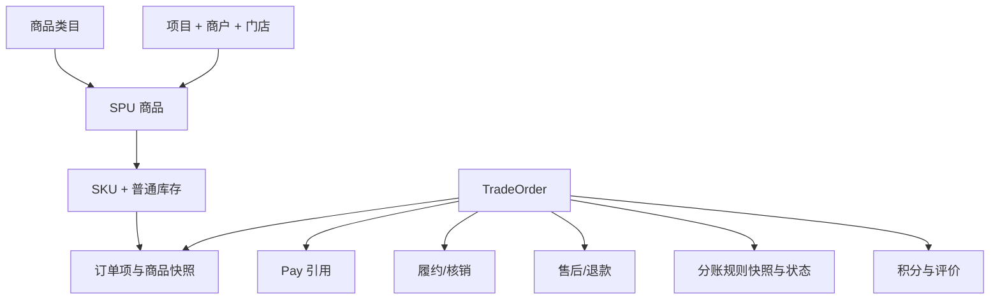
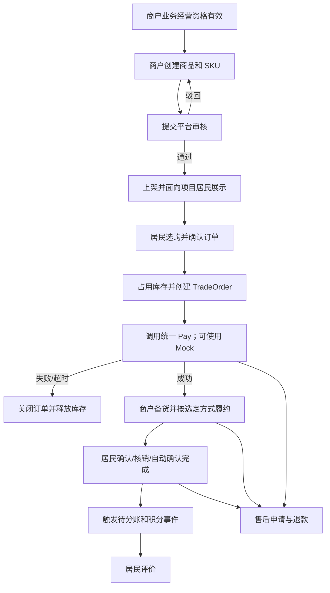
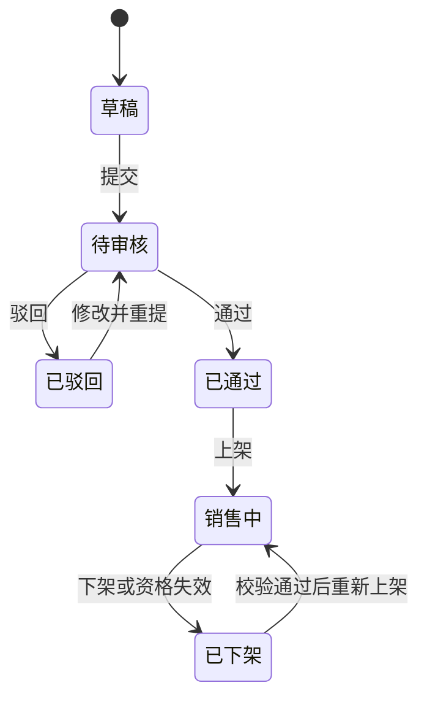
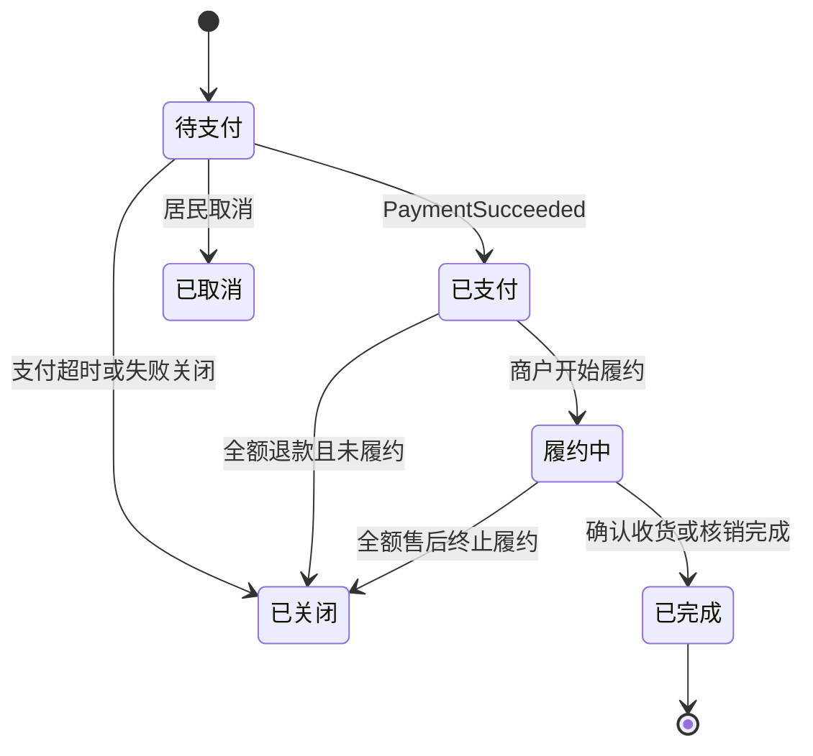
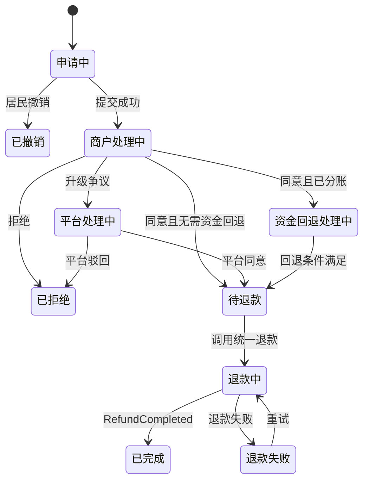

# 大光路智慧社区数字化运营平台 V1.0

# 02｜社区商城完整闭环产品需求详细设计

> 文档版本：V1.0  
> 编制日期：2026-09-02  
> 业务优先级：P1  
> 技术底座：RuoYi-Vue-Pro  
> 适用终端：管理后台 Web、住户小程序、商户小程序  
> 设计基线：《平台基础模型与商户合作关系产品需求详细设计 V1.2》、V1.0 一期开发清单、总表、总体开发计划及支付后置里程碑计划  
> 复用标识：【RuoYi直接复用】【RuoYi改造】【智慧社区新增开发】

---

## 1. 需求背景

### 1.1 业务背景

社区商城是大光路智慧社区数字化运营平台 V1.0 的最高优先级业务。平台需要在既有商户准入、合作协议、项目合作和经营授权基础上，形成“商户供给—平台审核—居民购买—商户履约—订单完成—资金后续处理—积分—评价—售后”的完整交易闭环。

本专题以 RuoYi-Vue-Pro Mall 为交易母体，优先复用商品、SKU、普通库存、购物车、Mall Trade、Pay、退款和评价等成熟能力，不重新建设第二套商城内核。社区化改造集中在 Project 项目上下文、多商户经营、商品审核、三类社区履约、分账业务标识、商户小程序及数据权限。

微信支付商户账号预计 2026 年 9 月底具备验证条件。9 月底前商城必须能够通过统一 Pay 抽象及 Mock Pay 完成业务闭环；真实微信支付、分账接收方、渠道接口、解冻及分账回退顺序在“05｜微信支付、退款与分账落地详细设计”中冻结。

### 1.2 建设目标

1. 建立以“Project + Operator + Store”为经营上下文的社区商品供给体系。
2. 支持商户小程序发布商品、平台 Web 审核、居民小程序购买的跨端流程。
3. 复用 Mall Trade 建立一订单一商户的稳定交易模型，完整保存商品、价格、商户、履约及分账规则快照。
4. 支持商户配送、社区自提、到店核销三种一期履约方式。
5. 在不依赖具体微信渠道实现的前提下，跑通支付、退款、待分账、积分和评价业务事件。
6. 明确库存占用与释放、超卖控制、售后退款及历史数据保留规则，为研发和测试提供统一依据。

### 1.3 本次范围

| 范围 | 一期内容 |
|---|---|
| 商品供给 | 商品类目、SPU、SKU、规格、价格、图片、详情、商户、门店、项目、审核、上下架 |
| 普通库存 | 可售、占用、扣减、释放、退款恢复、人工调整、并发控制 |
| 居民交易 | 商城首页、分类、列表、搜索、详情、SKU、购物车、地址、确认订单、支付结果、订单、退款、评价 |
| 商户经营 | 工作台、商品、SKU/库存、审核结果、订单、备货、配送、核销、售后、统一资金结果 |
| Web 运营 | 类目、商品审核、商品监管、订单监管、售后仲裁、评价监管 |
| 交易与履约 | 一订单一商户、Mall Trade、三类履约、确认完成、核销防重 |
| 支付边界 | 统一 Pay 调用、Mock Pay、稳定业务状态和业务事件 |
| 配套能力 | 消费积分事件、消息通知、操作日志、数据权限 |

### 1.4 本次不包含

- 社区团购、秒杀、拼团、预售和复杂优惠券组合；
- 跨商户合单、自动拆单、跨店满减；
- 多仓、采购、调拨、批次、保质期等复杂供应链；
- 骑手平台、运力调度、路线规划和实时定位；
- 商户钱包、提现、财务总账、自动开票；
- 真实微信支付渠道参数、分账接收方管理、分账 API、解冻、分账回退执行顺序；
- 退货物流平台；一期仅记录退货要求、线下退回结果及退款处理；
- 社区服务订单、物业缴费、邻里互助和停车缴费业务。

---

## 2. 整体业务设计

### 2.1 参与角色

| 角色 | 主要职责 | 主要使用端 |
|---|---|---|
| 平台运营管理员 | 类目维护、商品监管、订单监管、售后仲裁、评价监管 | Web |
| 商品审核人员 | 审核商户提交的商品及修改版本 | Web |
| 项目运营人员 | 管理本人负责项目内的商品、订单及履约异常 | Web |
| 客服/售后人员 | 处理升级售后、争议和平台强制退款 | Web |
| 商户负责人 | 商品发布、上下架、库存、订单履约和售后管理 | 商户小程序 |
| 商户工作人员 | 按角色和门店范围处理商品、库存、备货、配送或核销 | 商户小程序 |
| 居民会员 | 浏览、下单、支付、收货、申请售后和评价 | 住户小程序 |
| 系统任务 | 超时关单、自动确认、状态同步、消息补发和异常核对 | 后台任务 |

### 2.2 核心业务对象

| 业务对象 | 业务定义 | 与其他对象关系 |
|---|---|---|
| ProductCategory | 平台统一维护的商城商品类目 | 被经营授权、SPU 和审核规则引用 |
| ProductSPU | 商品公共信息及销售主对象 | 归属 Project、Operator，可限定 Store；包含多个 SKU |
| ProductSKU | 具体规格组合、售价和库存单元 | 归属一个 SPU；被订单项引用并固化快照 |
| Inventory | SKU 普通库存账户 | 维护可售、占用、已售及调整记录 |
| Cart | 居民购物车及商品选择 | 按项目和商户分组；下单时转为订单项 |
| MemberAddress | 居民收货地址 | 商户配送必选；下单时固化地址快照 |
| TradeOrder | 一次居民与一个商户的商城交易 | 包含多个 OrderItem，关联支付、履约、售后和分账结果 |
| OrderItem | 订单中的商品明细 | 保存 SPU、SKU、数量、价格及商品快照 |
| Fulfillment | 订单履约记录 | 按配送、自提或到店核销流转 |
| VerificationVoucher | 自提/到店核销凭证 | 一订单一有效凭证，可换码、核销且防重复 |
| AfterSale | 按订单项或订单发起的售后申请 | 关联退款、退货结果、审核和争议记录 |
| PayOrderRef | 商城订单对统一支付单的引用 | 只保存稳定业务引用和状态 |
| ProfitSharingSnapshotRef | 下单时固化的分账规则快照引用 | 用于完成后的待分账事件和售后资金判断 |
| ProductComment | 居民对已完成订单项的评价 | 关联订单项、商品、商户和项目 |
| PointTransactionRef | 消费积分发放或回退引用 | 由订单完成、退款事件触发 |

### 2.3 核心对象关系



### 2.4 总体业务流程



### 2.5 总体业务规则

| 编号 | 规则 |
|---|---|
| BR-MA-01 | 所有商品、订单、库存和履约数据必须保存明确 Project 归属；Project 不等同 Tenant |
| BR-MA-02 | 商品归属一个经营主体；一期一个 SPU 只归属一个项目，可限定一个门店或适用门店范围 |
| BR-MA-03 | 商户创建草稿只校验主体身份；提交审核、审核通过和上架均须校验对应项目、商城业务及商品类目的业务经营资格 |
| BR-MA-04 | 生产正式下单须校验正式交易资格；非生产或指定测试环境可在业务经营资格有效时使用 Mock Pay |
| BR-MA-05 | 一期一订单一商户；购物车可包含多商户商品，但结算时必须按商户分别提交并分别生成订单，不形成跨商户总订单 |
| BR-MA-06 | 订单创建时固化商品、SKU、成交价格、商户、门店、履约、地址及分账规则快照；源数据后续变化不覆盖历史订单 |
| BR-MA-07 | 订单状态、支付状态、履约状态、售后状态、退款状态和分账状态独立维护，不以单一状态代替多个业务维度 |
| BR-MA-08 | 主体、合作或授权后续失效时，禁止新增商品提交、上架和新订单；已支付历史订单仍允许履约、售后、退款及资金处理 |
| BR-MA-09 | 金额以分为最小计算单位；展示按元保留两位小数；订单实付金额不得小于 0 |
| BR-MA-10 | 所有库存变化必须有业务来源和数量流水；占用、释放、扣减、恢复和人工调整均不得直接覆盖历史记录 |
| BR-MA-11 | 商城业务只消费统一 Pay 稳定字段与事件，不识别微信渠道内部状态码 |
| BR-MA-12 | 订单完成后才触发“待分账”和消费积分事件；退款按退款金额撤销或冲正对应积分 |
| BR-MA-13 | 商品审核通过后发生影响交易判断的修改，须生成待审核版本；审核通过前线上继续使用原已发布版本 |
| BR-MA-14 | 关键状态操作必须后端二次校验并记录操作人、时间、前后状态、原因和业务来源 |

### 2.6 领域状态总览

#### 2.6.1 商品状态

商品使用“审核状态 + 销售状态”两个维度。

| 审核状态 | 含义 | 可执行操作 |
|---|---|---|
| 草稿 | 尚未提交平台审核 | 编辑、删除、提交审核 |
| 待审核 | 等待平台处理 | 查看、撤回 |
| 已驳回 | 审核未通过 | 查看原因、编辑、重新提交 |
| 已通过 | 当前版本审核通过 | 上架、下架、发起新版本修改 |

| 销售状态 | 含义 | 进入条件 |
|---|---|---|
| 未上架 | 尚未公开销售 | 新商品或审核通过未上架 |
| 销售中 | 项目居民可见且可购买 | 审核通过、资格有效、至少一个 SKU 可售 |
| 已下架 | 人工或系统停止销售 | 商户/平台下架、资格失效、商品异常 |



#### 2.6.2 订单及资金状态

| 维度 | 一期稳定状态 |
|---|---|
| 交易状态 | 待支付、已支付、履约中、已完成、已取消、已关闭 |
| 支付状态 | 未支付、支付中、支付成功、支付失败、已关闭 |
| 履约状态 | 见 2.6.3，按履约方式分别流转 |
| 售后状态 | 无售后、申请中、商户处理中、平台处理中、已同意、已拒绝、已撤销、已完成、已关闭 |
| 退款状态 | 无退款、待退款、资金回退处理中、退款中、退款成功、退款失败 |
| 分账状态 | 不需要、待分账、分账处理中、分账成功、分账失败、回退处理中、已回退；仅保存统一业务状态 |

订单主状态流转：



部分退款不改变订单主状态，按订单项及售后状态表达；全部商品全额退款并终止履约时订单进入已关闭，保留完整支付和退款记录。

#### 2.6.3 履约状态

| 履约方式 | 状态链 |
|---|---|
| 商户配送 | 待备货 → 待配送 → 配送中 → 已送达 → 已完成 |
| 社区自提 | 待备货 → 待自提 → 已核销 → 已完成 |
| 到店核销 | 待核销 → 已核销 → 已完成 |

#### 2.6.4 售后与退款状态



---

## 3. 功能与页面结构

### 3.1 功能/菜单结构

以下编号、名称和顺序与 3.2 及第 4 章逐项对应。

| 编号 | 终端 | 一级菜单/入口 | 功能/页面 |
|---|---|---|---|
| 4.1 | Web | 商城运营 | 商品类目 |
| 4.2 | 商户小程序 | 商品 | 商品管理 |
| 4.3 | 商户小程序 | 商品 | SKU 与库存 |
| 4.4 | Web | 商城运营 | 商品审核与监管 |
| 4.5 | 商户小程序 | 商品 | 商品审核结果与上下架 |
| 4.6 | 住户小程序 | 商城 | 商城首页、分类与商品列表 |
| 4.7 | 住户小程序 | 商城 | 商品详情与 SKU 选择 |
| 4.8 | 住户小程序 | 商城 | 购物车 |
| 4.9 | 住户小程序 | 我的 | 收货地址 |
| 4.10 | 住户小程序 | 商城结算 | 确认订单与创建订单 |
| 4.11 | 住户小程序 | 商城结算 | 支付结果 |
| 4.12 | 商户小程序 | 工作台 | 商城工作台 |
| 4.13 | 商户小程序 | 订单 | 商城订单管理 |
| 4.14 | Web | 交易管理 | 商城订单监管 |
| 4.15 | 商户小程序 | 订单履约 | 商户配送 |
| 4.16 | 商户小程序 | 订单履约 | 社区自提与到店核销 |
| 4.17 | 住户小程序 | 我的订单 | 订单列表与详情 |
| 4.18 | 住户小程序 | 售后 | 取消订单与售后申请 |
| 4.19 | 商户小程序 | 售后 | 商户售后处理 |
| 4.20 | Web | 售后管理 | 售后监管与仲裁 |
| 4.21 | 住户小程序 | 售后 | 退款结果 |
| 4.22 | 住户小程序 | 评价 | 商品评价 |
| 4.23 | Web | 评价管理 | 评价监管 |
| 4.24 | 商户小程序 | 评价 | 商户评价查看与回复 |

### 3.2 页面清单

| 编号 | 端 | 功能/页面 | 页面用途 | 使用角色 | 核心操作 | 复用结论 |
|---|---|---|---|---|---|---|
| 4.1 | Web | 商品类目 | 维护商城统一类目 | 平台运营 | 新增、编辑、排序、启停 | 【RuoYi直接复用】为主 |
| 4.2 | 商户小程序 | 商品管理 | 创建和维护 SPU | 商户负责人/商品人员 | 新增、编辑、保存、复制 | 【RuoYi改造】 |
| 4.3 | 商户小程序 | SKU 与库存 | 维护规格、价格、普通库存 | 商户商品/库存人员 | 生成 SKU、改价、调库存 | 【RuoYi改造】 |
| 4.4 | Web | 商品审核与监管 | 审核及平台监管 | 商品审核/运营人员 | 通过、驳回、强制下架 | 【智慧社区新增开发】 |
| 4.5 | 商户小程序 | 商品审核结果与上下架 | 查看结果和控制销售 | 商户商品人员 | 撤回、重提、上架、下架 | 【智慧社区新增开发】 |
| 4.6 | 住户小程序 | 商城首页、分类与商品列表 | 居民发现商品 | 居民会员 | 分类、筛选、搜索、进入详情 | 【RuoYi改造】 |
| 4.7 | 住户小程序 | 商品详情与 SKU 选择 | 查看并选择可售商品 | 居民会员 | 选 SKU、加购、立即购买 | 【RuoYi直接复用】为主 |
| 4.8 | 住户小程序 | 购物车 | 汇总待购商品 | 居民会员 | 改数量、删除、按商户结算 | 【RuoYi改造】 |
| 4.9 | 住户小程序 | 收货地址 | 管理配送地址 | 居民会员 | 新增、编辑、删除、设默认 | 【RuoYi直接复用】 |
| 4.10 | 住户小程序 | 确认订单与创建订单 | 确认履约、金额和快照 | 居民会员 | 选地址/方式、提交订单 | 【RuoYi改造】 |
| 4.11 | 住户小程序 | 支付结果 | 展示统一支付结果 | 居民会员 | 继续支付、查订单 | 【RuoYi改造】 |
| 4.12 | 商户小程序 | 商城工作台 | 汇总待办与经营数据 | 商户负责人/工作人员 | 穿透待办、查看摘要 | 【智慧社区新增开发】 |
| 4.13 | 商户小程序 | 商城订单管理 | 查看并处理所属订单 | 商户订单人员 | 接单、备货、履约、备注 | 【RuoYi改造】 |
| 4.14 | Web | 商城订单监管 | 平台查询和异常处理 | 运营/客服 | 查询、备注、关闭、穿透资金 | 【RuoYi改造】 |
| 4.15 | 商户小程序 | 商户配送 | 完成配送履约 | 商户履约人员 | 备货、发货、送达 | 【智慧社区新增开发】 |
| 4.16 | 商户小程序 | 社区自提与到店核销 | 生成及核销凭证 | 商户核销人员 | 备货、扫码/输码、核销 | 【RuoYi改造】 |
| 4.17 | 住户小程序 | 订单列表与详情 | 查看交易和履约进度 | 居民会员 | 支付、取消、确认收货、售后 | 【RuoYi改造】 |
| 4.18 | 住户小程序 | 取消订单与售后申请 | 发起取消/退款 | 居民会员 | 选明细、原因、金额、提交 | 【RuoYi改造】 |
| 4.19 | 商户小程序 | 商户售后处理 | 处理本商户申请 | 商户售后人员 | 同意、拒绝、确认退回、升级 | 【RuoYi改造】 |
| 4.20 | Web | 售后监管与仲裁 | 监管和处理争议 | 平台客服/运营 | 仲裁、强制退款、重试 | 【RuoYi改造】 |
| 4.21 | 住户小程序 | 退款结果 | 查看售后和退款进度 | 居民会员 | 撤销、补充凭证、查看结果 | 【RuoYi改造】 |
| 4.22 | 住户小程序 | 商品评价 | 对完成订单项评价 | 居民会员 | 评分、文字、图片、提交 | 【RuoYi直接复用】为主 |
| 4.23 | Web | 评价监管 | 查询和处置违规评价 | 平台运营 | 隐藏、恢复、查看举报 | 【RuoYi改造】 |
| 4.24 | 商户小程序 | 商户评价查看与回复 | 查看评价并公开回复 | 商户人员 | 筛选、查看、回复 | 【RuoYi改造】 |

### 3.3 核心操作路径

#### 3.3.1 商品供给与上架

```text
4.1 Web 配置商品类目
→ 4.2 商户小程序创建商品
→ 4.3 商户小程序配置 SKU、价格和库存
→ 4.4 Web 审核商品
→ 4.5 商户小程序查看结果并上架
→ 4.6/4.7 住户小程序可见
```

#### 3.3.2 居民购买与商户履约

```text
4.6/4.7 居民选购
→ 4.8 购物车或立即购买
→ 4.9 选择地址
→ 4.10 确认并创建订单
→ 4.11 调用统一 Pay 并查看结果
→ 4.12/4.13 商户接收订单
→ 4.15 配送 或 4.16 自提/到店核销
→ 4.17 居民确认完成
→ 触发待分账、积分和评价资格
```

#### 3.3.3 售后与评价

```text
4.17 订单详情
→ 4.18 发起售后
→ 4.19 商户处理
→ 必要时 4.20 平台仲裁
→ 4.21 查看退款结果
→ 4.22 评价
→ 4.23/4.24 平台监管与商户回复
```

---

## 4. 功能详细设计

### 4.1 商品类目（Web）

#### 4.1.1 功能概述

平台运营人员维护项目商城统一使用的一级、二级商品类目。类目是商品创建、项目经营授权、审核和居民展示的共同主数据。【RuoYi直接复用】Mall Product 类目树、排序和启停能力；商城/服务类目隔离及 Project 可用范围属于【RuoYi改造】。

#### 4.1.2 字段、数据和页面规则

| 字段 | 来源/控件 | 必填 | 可编辑条件 | 规则 |
|---|---|:---:|---|---|
| 类目名称 | 输入 | 是 | 新增/未被停用锁定 | 同父级下名称不重复，1—20 字 |
| 上级类目 | 树选择 | 否 | 新增/编辑 | 一期最多二级，不可选择自身或子级 |
| 类目图标 | 图片 | 否 | 新增/编辑 | 居民端展示，支持统一附件规则 |
| 排序 | 数字 | 是 | 任意 | 数值越小越靠前 |
| 适用项目 | 多选 | 否 | 启用时可改 | 空表示全部项目；不得越过操作者项目权限 |
| 状态 | 启用/停用 | 是 | 任意 | 存在销售中商品时停用需二次确认 |

页面由类目树、查询区和编辑抽屉组成。支持名称模糊查询、状态和项目筛选。已被商品或授权引用的类目不可物理删除，只能停用；停用后禁止新建和新授权，历史商品与订单仍显示类目快照。

#### 4.1.3 后端、权限、异常与验收

保存前校验层级、同级唯一性和项目范围；停用时返回受影响的销售中商品数量，并由用户确认是否同步触发平台下架。平台运营管理员可维护，项目运营人员仅查看本项目可用类目。

验收：最多二级；同级重名受控；停用类目不可用于新商品；历史订单不受影响；跨项目不可配置；类目树和居民端分类顺序一致。

### 4.2 商品管理（商户小程序）

#### 4.2.1 功能概述与业务对象

商户在小程序创建和维护 SPU。该章节是商品公共业务规则的主规则章节。【RuoYi改造】Mall Product SPU，增加 operator、project、store、审核版本及经营资格。

| 对象 | 创建时机 | 更新时机 | 失效方式 | 关联对象 |
|---|---|---|---|---|
| SPU | 商户保存首个草稿 | 草稿编辑、驳回修改、发布新版本 | 下架，不物理删除已引用商品 | 类目、商户、门店、项目、SKU |
| 商品版本 | 首次提交和已发布商品重大修改 | 每次重新提交 | 被新审核版本替代 | 审核记录、线上发布版本 |

#### 4.2.2 核心字段

| 字段 | 数据来源/控件 | 必填 | 默认值 | 可编辑条件 | 校验/规则 |
|---|---|:---:|---|---|---|
| 项目 | 当前上下文 | 是 | 当前项目 | 创建后不可改 | 商户必须具备该项目商城身份 |
| 所属商户 | 登录身份 | 是 | 当前主体 | 不可改 | 不接受前端任意传入 |
| 所属门店 | 授权门店选择 | 条件必填 | 默认门店 | 草稿/驳回 | 到店核销必填；须在授权范围内 |
| 商品类目 | 级联选择 | 是 | 无 | 草稿/驳回/新版本 | 必须启用且在授权范围内 |
| 商品名称 | 输入 | 是 | 无 | 同上 | 2—60 字，不得含禁用词 |
| 副标题/卖点 | 输入 | 否 | 无 | 同上 | 最多 100 字 |
| 主图/轮播图 | 图片 | 是 | 无 | 同上 | 主图 1 张；轮播 1—9 张 |
| 商品详情 | 富文本/图文 | 是 | 无 | 同上 | 过滤脚本和外链风险内容 |
| 履约方式 | 多选 | 是 | 无 | 同上 | 配送/社区自提/到店核销至少一种 |
| 配送说明 | 输入 | 条件必填 | 无 | 选配送时 | 配送范围、预计时效或费用说明 |
| 售后说明 | 输入 | 是 | 平台模板 | 同上 | 不得低于平台强制规则 |
| 上架时间 | 立即/指定时间 | 否 | 审核后手动上架 | 审核通过后 | 指定时间须晚于当前时间 |

#### 4.2.3 数据与状态规则

- 草稿可保存不完整数据，但提交审核时必须完成全部必填校验并至少有一个有效 SKU。
- 已发布商品修改名称、类目、主图、详情、履约方式、价格或规格，形成新待审核版本；线上继续展示原版本。
- 仅修改普通库存不触发商品重新审核；是否将小幅价格修改免审作为后续配置，一期价格修改重新审核。
- 待审核不可直接编辑，可撤回后编辑；审核中源资格失效时审核不通过并给出原因。
- 无历史订单的草稿可删除；存在审核或订单引用后只允许作废草稿版本或下架商品。

#### 4.2.4 页面、交互与后端规则

页面包含商品列表、状态 Tab、商品编辑步骤页和预览页。列表显示主图、名称、类目、价格区间、库存合计、审核/销售状态、驳回原因摘要。编辑按“基础信息—图文详情—履约与售后—SKU/库存—预览提交”组织。

提交路径：校验商户及项目 → 校验类目经营授权 → 校验门店与资质 → 校验字段和 SKU → 固化提交版本 → 状态改为待审核 → 生成 Web 审核待办与消息。重复点击使用提交幂等标识；已提交则返回现有结果。

#### 4.2.5 权限、异常与验收

商户负责人和商品管理员可新增/编辑；门店人员仅在授权门店范围操作。主体、项目、业务类型和数据范围均由后端从登录关系核对。

验收：可保存草稿；必填不足不可提交；超授权类目或门店不可提交；已发布商品重大修改不影响线上旧版本；重复提交不产生两条审核；跨商户商品不可访问。

### 4.3 SKU 与库存（商户小程序）

#### 4.3.1 功能概述与模型

维护商品规格、SKU、售价和一期普通库存。【RuoYi直接复用】规格组合、SKU、库存占用/释放基础；商户小程序交互、项目/商户归属和库存权限属于【RuoYi改造】。

普通库存口径：

```text
物理可管理库存 = 可售库存 + 下单占用库存
下单可购买数量 = 可售库存
支付成功不再次重复扣减，而是将占用量确认为已售
```

#### 4.3.2 SKU 与库存字段

| 字段 | 来源/控件 | 必填 | 可编辑条件 | 规则 |
|---|---|:---:|---|---|
| 规格名称/值 | 规格编辑器 | 条件必填 | 草稿/驳回/新版本 | 多规格商品必须配置；组合不可重复 |
| SKU 图片 | 图片 | 否 | 同上 | 未传使用 SPU 主图 |
| 销售价 | 金额 | 是 | 草稿/驳回/新版本 | 大于 0，精确到分 |
| 划线价 | 金额 | 否 | 同上 | 不低于销售价 |
| SKU 编码 | 输入/系统生成 | 是 | 未产生订单前 | 商户内唯一 |
| 可售库存 | 数字 | 是 | 有库存权限时 | 非负整数；列表展示实时结果 |
| 占用库存 | 系统 | 是 | 只读 | 待支付订单占用数量 |
| 库存预警值 | 数字 | 否 | 任意 | 非负整数，低于时工作台提示 |
| 调整数量/原因 | 数字+原因 | 调整时必填 | 商品未永久终止 | 调整后可售不得小于 0 |

#### 4.3.3 库存业务规则

| 场景 | 库存处理 | 幂等/并发要求 |
|---|---|---|
| 创建订单 | 原子校验并从可售转入占用 | 同一订单项只占用一次；不足则整单创建失败 |
| 支付成功 | 占用转为已售 | 重复 PaymentSucceeded 不重复确认 |
| 支付失败/超时关闭 | 释放占用回可售 | 按订单关闭事件唯一处理 |
| 未支付主动取消 | 释放占用回可售 | 与关单互斥，先成功者生效 |
| 已支付未履约全额退款 | 退款完成后自动恢复可售 | 仅未出库商品；同一退款只恢复一次 |
| 已履约退款 | 根据“是否已退回且可再次销售”决定 | 商户/平台确认可恢复后执行 |
| 部分退款 | 按成功退款的商品数量处理 | 金额退款但商品未退回时不恢复 |
| 人工调整 | 增加或减少可售库存并记流水 | 采用版本校验；冲突提示刷新后重试 |

防超卖要求：后端以 SKU 最新可售库存原子校验和占用；前端显示库存只用于体验，不作为成交依据。批量创建多个订单项时，任何 SKU 不足则本订单全部不创建、已占用部分全部回滚。库存流水保存业务类型、业务单号、变动前后数量、变动量、操作者和时间。

#### 4.3.4 页面、权限、异常与验收

规格编辑支持单规格和多规格组合；批量设置价格、库存和预警值。库存调整使用独立弹窗并二次确认，不允许直接覆盖占用库存。商品管理员可配置 SKU；库存管理员只能调库存，不能改商品和价格。

验收：SKU 组合唯一；库存不足不能下单；超时/取消正确释放；支付成功不重复扣减；退款恢复符合是否退回规则；并发购买不超卖；所有人工调整可追溯。

### 4.4 商品审核与监管（Web）

#### 4.4.1 功能概述

平台审核商户提交的商品版本并监管已发布商品。【智慧社区新增开发】商品审核流程；复用 Mall 商品详情和列表基础。

#### 4.4.2 页面与操作

| 区域/操作 | 规则 |
|---|---|
| 查询 | 项目、商户、门店、类目、审核状态、销售状态、提交时间、商品名称 |
| 列表 | 展示商户、版本、价格区间、库存、资格摘要、提交人和时间 |
| 审核详情 | 当前提交版本与线上版本对比；展示字段、图片、详情、SKU、履约和售后 |
| 通过 | 资格有效且内容合规；填写可选意见；更新审核版本 |
| 驳回 | 驳回原因必填，可选择问题字段并给出修改建议 |
| 强制下架 | 仅销售中商品；原因必填；生成商户通知；不影响历史订单 |

#### 4.4.3 后端、权限和异常

审核通过前再次实时核对商户业务经营资格、类目、门店和商品版本；版本已撤回或已被处理时禁止重复审核。通过后商品为已通过/未上架；若商户提交时选择审核后自动上架且条件满足，可进入销售中。强制下架时取消居民端新购买入口，但已创建订单继续处理。

商品审核人员按被授权项目处理；平台运营可监管全部授权项目；项目运营只能处理本项目。审核本人不得通过绕过数据权限访问其他项目。

验收：待审核版本可完整预览；资格失效不可通过；驳回原因准确回传；并发审核只有一次成功；强制下架立即阻止新订单；历史订单不被修改。

### 4.5 商品审核结果与上下架（商户小程序）

#### 4.5.1 功能概述与复用关系

商品对象、版本、字段、审核状态和业务规则与 4.2、4.4 相同。本页面仅补充商户端结果、撤回、重提及上下架交互。【智慧社区新增开发】。

#### 4.5.2 页面、交互与验收

结果页展示审核状态、提交版本、提交/审核时间、审核人员、驳回字段和完整原因。待审核可撤回；已驳回跳转 4.2 并基于驳回版本编辑；已通过显示上架按钮；销售中显示下架；已下架重新上架时实时校验经营资格、有效 SKU 和可售库存。

商户只可操作所属主体及有权限门店商品。系统强制下架时展示平台原因，商户不可直接重新上架，需按提示整改并重新提交审核。

验收：结果与 Web 一致；撤回后 Web 不可审核；驳回可定位问题字段；无库存、资格失效或平台强制下架未解除时不可上架；上下架结果实时影响居民端。

### 4.6 商城首页、分类与商品列表（住户小程序）

#### 4.6.1 功能概述

向居民展示当前 Project 内可购买商品。【RuoYi改造】商城首页、分类和列表，增加项目、业务资格、商户和社区履约过滤；首页 Banner 的运营配置在“09｜三端首页、导航、消息”专题收口。

#### 4.6.2 展示与查询规则

| 区域/字段 | 规则 |
|---|---|
| 当前项目 | 使用住户当前项目上下文；切换项目后重新加载，不混用购物车勾选状态 |
| 分类 | 仅展示启用且当前项目可用、存在销售中商品的类目 |
| 推荐 | 一期支持平台人工排序和新品；无复杂推荐算法 |
| 搜索 | 商品名称、副标题、商户名称模糊匹配；最多保留近期搜索记录 |
| 筛选 | 类目、商户、履约方式；价格排序和销量排序为 S1 |
| 商品卡 | 主图、名称、价格、商户、履约标签、库存紧张/售罄状态 |

列表接口只返回销售中、当前时间可售、业务经营资格有效且属于当前项目的商品。售罄商品可展示但不可下单；已下架商品从新列表移除。分页加载失败保留已有内容并提供重试。

#### 4.6.3 权限与验收

登录居民可访问；未登录可浏览时，不得进入确认订单，点击购买引导登录。项目上下文缺失时引导选择/绑定社区，不默认展示其他项目商品。

验收：项目隔离正确；类目与排序一致；下架商品不再出现；售罄不可购买；搜索和筛选组合正确；未登录购买引导正确。

### 4.7 商品详情与 SKU 选择（住户小程序）

#### 4.7.1 功能概述与字段

展示审核通过的线上商品版本并选择 SKU。【RuoYi直接复用】Mall 商品详情与 SKU 选择，增加商户、项目经营状态和三类履约说明。

| 展示项 | 来源 | 规则 |
|---|---|---|
| 商品图文 | 当前线上审核版本 | 不展示待审核修改内容 |
| 商品价格 | SKU 价格区间/选中 SKU | 选择后显示准确成交单价 |
| 商户/门店 | SPU 归属 | 可进入商户简要信息页；不暴露敏感主体资料 |
| 库存 | SKU 实时可售库存 | 库存紧张可显示剩余量；实际以下单校验为准 |
| 履约方式 | 商品配置 | 展示配送、自提、到店核销及说明 |
| 售后说明 | 商品快照来源 | 下单后固化，不因后续修改变化 |

#### 4.7.2 交互、异常与验收

未选完整 SKU 时“加入购物车/立即购买”先弹出选择器；数量范围为 1 至当前可售库存和单次限购上限的较小值。点击提交前刷新商品销售状态、资格、SKU 价格和库存；发生变化时明确提示并要求确认新信息。

验收：SKU 联动价格、图片和库存正确；不可售商品按钮禁用；待审核版本不泄露；跨项目链接打开时提示不可购买；价格或库存变化提示正确。

### 4.8 购物车（住户小程序）

#### 4.8.1 功能概述

保存居民待购 SKU 并按项目、商户分组。【RuoYi直接复用】购物车基础；“一订单一商户”的分组选择和结算限制属于【RuoYi改造】。

#### 4.8.2 数据、页面与后端规则

购物车项保存项目、商户、SPU、SKU、数量和加入时信息；展示时读取最新商品状态、价格和库存。失效项保留并标记下架、售罄、SKU 失效、资格失效或跨项目，不允许勾选，可单独清理。

购物车可存在多个商户分组，但一次点击“去结算”只能选择同一商户的商品；跨商户同时勾选时提示“请按商户分别结算”。同 SKU 再次加入时合并数量，但不得超过可售及限购数量。

#### 4.8.3 验收

同 SKU 正确合并；最新价格和失效状态正确；跨商户不可一次结算；切换项目不错误结算原项目商品；删除和数量修改实时同步；库存并发变化最终以 4.10 创建订单为准。

### 4.9 收货地址（住户小程序）

#### 4.9.1 功能概述与规则

复用 Member 收货地址能力。【RuoYi直接复用】。地址包含收货人、手机号、省市区、详细地址、地址标签和默认标识。手机号需合法；详细地址 5—100 字；同一会员仅一个默认地址。

商户配送必须选择地址；社区自提和到店核销不要求收货地址，但须保留联系人及手机号。订单创建后固化地址/联系人快照，后续修改地址簿不更新历史订单。

#### 4.9.2 页面、权限与验收

支持列表、新增、编辑、删除和设默认；被历史订单引用的地址仍可从地址簿删除，不影响快照。居民只能管理本人地址。

验收：默认地址唯一；手机号和必填校验有效；配送订单必须选择；删除地址不影响历史订单；跨用户不可访问。

### 4.10 确认订单与创建订单（住户小程序）

#### 4.10.1 功能概述与业务对象

将购物车或立即购买信息转换为一笔 Mall Trade 商品订单，是交易主规则章节。【RuoYi改造】Trade Order，增加 Project、Operator、Store、社区履约、分账引用及多维状态。

#### 4.10.2 稳定订单字段

| 字段 | 来源 | 规则 |
|---|---|---|
| 业务订单号 | 系统生成 | 全局唯一、可读、不可修改 |
| project | 当前项目 | 创建后不可变 |
| member | 登录会员 | 后端获取，不信任前端 |
| operator/store | 商品归属及履约选择 | 同订单全部订单项必须同一商户 |
| OrderItem | 选中 SKU | 保存商品、规格、数量和售后资格 |
| 商品快照 | 线上审核版本 | 名称、图片、规格、类目、履约/售后说明 |
| 价格快照 | 实时计价结果 | SKU 单价、商品小计、优惠、运费、应付和实付 |
| 商户快照 | 有效主体与门店公开信息 | 历史订单稳定显示 |
| 履约方式/快照 | 居民选择 | 配送、自提、到店核销及地址/联系人 |
| pay_order_id | Pay 创建成功返回 | 未创建时为空；一笔业务订单关联当前有效支付单 |
| payable_amount | 订单计价 | 大于等于 0，以分计 |
| pay_status | Pay 业务状态 | 不保存微信内部状态码 |
| refund_status | 退款聚合结果 | 从售后/退款业务汇总 |
| profit_sharing_required | 资金规则判断 | Mock 阶段也保存业务判断 |
| profit_sharing_status | 统一业务状态 | 不在商城执行渠道细节 |
| 分账规则快照引用 | 有效规则生成 | 保存引用、版本和关键金额口径摘要 |
| 履约状态 | 履约对象 | 按方式流转 |
| 售后状态 | 售后聚合 | 多售后时展示汇总状态 |

#### 4.10.3 确认页字段与交互

确认页展示商品明细、商户、履约方式、地址/自提点/门店、联系人、商品金额、运费、优惠、应付金额、买家留言和售后说明。配送方式仅显示商品支持且当前可用的选项；一期一个订单只能选择一种履约方式。

提交按钮防重复点击。价格、库存或履约条件变化时不静默创建订单，返回变更明细并要求居民重新确认。

#### 4.10.4 创建订单业务路径

```text
校验登录会员与 Project
→ 校验商品属于同一商户和同一项目
→ 实时校验业务经营资格/正式交易资格或 Mock 白名单
→ 校验商品、SKU、价格、库存和限购
→ 校验履约方式、地址/门店及服务范围
→ 重新计价并生成价格结果
→ 原子占用全部 SKU 库存
→ 固化商品、价格、商户、履约及分账规则快照
→ 创建 TradeOrder 与 OrderItem
→ 创建/关联统一 PayOrder
→ 返回订单及支付发起信息
```

任一步失败不得留下可支付的半成品订单；已占用库存须释放。相同提交幂等标识重复请求返回原订单。

#### 4.10.5 状态、权限、异常与验收

创建成功进入待支付/未支付，支付有效期采用平台统一配置，建议一期 15 分钟；到期由 Pay/订单核对任务关闭并释放库存。正式生产环境资格不具备时禁止发起真实支付；测试环境可标明“模拟支付”。

验收：一订单一商户；字段和快照完整；库存原子占用；价格变化要求确认；重复提交仅一单；失败无脏订单；超时关单释放库存；正式交易资格/Mock 环境边界正确。

### 4.11 支付结果（住户小程序）

#### 4.11.1 功能概述与 Pay 边界

页面仅面向统一 Pay 业务状态，不识别微信渠道细节。【RuoYi改造】Pay 发起与结果页；Mock 适配属于测试支撑。

商城允许调用：创建支付、发起支付、查询支付结果、关闭支付；消费 `pay_order_id`、`payable_amount`、`pay_status` 及 PaymentSucceeded、PaymentFailed 等业务事件。不得调用或展示分账接收方、渠道证书、微信分账状态码和解冻参数。

#### 4.11.2 页面与后端规则

| 状态 | 页面反馈 | 可用操作 |
|---|---|---|
| 支付成功 | 成功金额、订单号、履约摘要 | 查看订单、返回商城 |
| 支付处理中 | 明确正在确认，不显示失败 | 主动查询、稍后查看订单 |
| 支付失败 | 失败业务原因 | 重新支付、查看订单 |
| 已关闭/超时 | 订单已关闭及库存释放提示 | 重新购买 |
| Mock 成功 | 测试环境明显标识 | 查看模拟订单 |

PaymentSucceeded 处理必须幂等：核对订单金额和待支付状态 → 支付状态改成功 → 占用库存确认为已售 → 订单进入已支付 → 生成商户待处理消息。重复回调不重复扣库存或发放权益。前端超时不等于支付失败，应查询最终结果。

#### 4.11.3 验收

成功、处理中、失败、关闭和 Mock 状态展示准确；重复成功事件无副作用；订单金额不一致进入异常而非成功；页面关闭后回调仍可更新订单；支付失败/超时库存释放正确。

### 4.12 商城工作台（商户小程序）

#### 4.12.1 功能概述

汇总当前项目、商户及人员权限范围内的商城待办和经营摘要。【智慧社区新增开发】。

| 指标/待办 | 口径 | 穿透 |
|---|---|---|
| 今日支付订单/金额 | 当日 PaymentSucceeded，扣退款前毛额 | 4.13 对应列表 |
| 待审核商品 | 当前待审核版本数 | 4.5 |
| 待备货 | 已支付且履约为待备货 | 4.13 |
| 待配送 | 配送订单备货完成 | 4.15 |
| 待自提/核销 | 已生成有效核销凭证 | 4.16 |
| 售后待处理 | 商户处理中且未超时 | 4.19 |
| 待分账/已分账 | 统一业务状态与金额摘要 | 4.13 资金结果区 |

指标不作为财务结算凭证；资金结果只显示统一业务口径。人员按门店权限聚合，不得通过工作台看到无权订单。

验收：指标与穿透列表口径一致；项目/商户/门店隔离正确；待办实时或可接受延迟内更新；资金状态不暴露配置和接收方敏感信息。

### 4.13 商城订单管理（商户小程序）

#### 4.13.1 功能概述与复用关系

商户查看并处理本主体商城订单。订单对象、快照、多维状态和支付处理与 4.10、4.11 相同，本章仅定义商户视图及操作差异。【RuoYi改造】。

#### 4.13.2 页面与操作

列表按待处理、履约中、已完成、售后分 Tab，支持订单号、商品、日期、履约方式和状态筛选。详情展示订单项、居民必要联系信息、地址/核销信息、买家留言、金额、支付状态、分账统一状态、履约时间线、售后和商户备注。

| 操作 | 条件 | 结果 |
|---|---|---|
| 确认接单/开始备货 | 已支付且无阻断售后 | 履约进入待备货或按到店方式待核销 |
| 备货完成 | 配送/自提待备货 | 分别进入待配送/待自提 |
| 联系居民 | 有订单权限 | 使用脱敏号码或合规联系方式 |
| 商户备注 | 有订单权限 | 仅商户和平台可见，保留修改日志 |
| 查看资金结果 | 已支付 | 只读显示应付、退款、分账状态摘要 |

#### 4.13.3 后端、权限、异常与验收

每次操作实时校验订单当前状态、所属商户、门店权限和售后阻断；并发操作仅第一个合法请求成功。商户负责人可看主体全部订单，门店人员只看授权门店，履约人员按职责操作。

验收：订单和快照完整；按钮随状态正确；跨商户/门店访问失败；售后阻断时不可继续履约；并发备货或发货不重复；资金结果与统一状态一致。

### 4.14 商城订单监管（Web）

#### 4.14.1 功能概述与复用关系

平台对商城订单进行跨商户、跨项目监管。TradeOrder 公共规则与 4.10 相同；Web 增加项目权限、异常筛选、操作日志和业务穿透。【RuoYi改造】。

#### 4.14.2 页面、操作与权限

查询项包括项目、商户、门店、居民、订单号、商品、交易/支付/履约/售后/退款/分账状态及时间范围。详情以 Tab 展示订单、快照、支付引用、履约时间线、售后、积分事件、操作日志。

平台可在严格权限下执行业务关单、异常备注、督促履约、跳转 Pay/售后/分账状态页；已支付订单不得通过普通“关闭”绕过退款。平台强制完成、强制退款等高风险操作仅客服主管/运营管理员可用，原因必填并二次确认。

验收：多维状态可组合查询；项目数据权限正确；任何人工操作留痕；已支付订单不可直接关单抹除资金；可穿透但不在商城页修改渠道配置。

### 4.15 商户配送（商户小程序）

#### 4.15.1 功能概述与状态

支持商户自有人员完成社区内配送，不建设骑手系统。【智慧社区新增开发】。

| 当前状态 | 操作 | 前置条件 | 下一状态 | 结果 |
|---|---|---|---|---|
| 待备货 | 开始/完成备货 | 已支付，无退款阻断 | 待配送 | 通知居民备货完成 |
| 待配送 | 开始配送 | 有履约权限 | 配送中 | 记录配送人和出发时间 |
| 配送中 | 标记送达 | 地址有效 | 已送达 | 通知居民确认收货 |
| 已送达 | 居民确认/系统自动确认 | 无进行中全额售后 | 已完成 | 订单完成并触发后续事件 |

#### 4.15.2 字段、交互和后端规则

配送记录保存配送人、联系方式、备货时间、出发时间、送达时间、可选送达凭证和商户备注。标记送达需二次确认；平台可配置是否必须上传凭证，一期默认非必填。

系统自动确认时间从“标记送达”开始计算，建议一期 7 天，可由平台参数配置。居民在自动确认前发起全额售后时暂停自动确认。配送状态不可跳级；误操作由平台处理，不允许商户自行回退已送达。

#### 4.15.3 权限、异常与验收

仅订单所属商户且有履约权限人员操作。地址展示遵循最小必要原则；订单完成后按规则脱敏。

验收：状态不可跳级；每步时间与人员完整；重复点击不重复流转；售后可阻断完成；居民确认和自动确认均只触发一次完成事件；不出现骑手调度能力。

### 4.16 社区自提与到店核销（商户小程序）

#### 4.16.1 功能概述与凭证规则

社区自提适用于商户备货后居民到指定自提点取货；到店核销适用于无需备货或到店即时交付商品。【RuoYi改造】Mall 自提基础，增加社区核销角色和防重规则。

核销凭证在支付成功且履约条件满足后生成，包含业务订单号、随机核销码、二维码、有效期、状态和适用门店。居民在 4.17 展示二维码/数字码；商户可扫码或输入码核销。

#### 4.16.2 状态和操作

| 方式 | 前置动作 | 待核销状态 | 核销后 |
|---|---|---|---|
| 社区自提 | 商户备货完成 | 待自提 | 已核销 → 已完成 |
| 到店核销 | 支付成功生成凭证 | 待核销 | 已核销 → 已完成 |

核销前后端共同校验凭证有效、未核销、订单已支付、当前门店/人员有权限、无全额售后阻断。核销成功使用一次性幂等请求，同一凭证仅一次成功；重复扫码返回已核销时间和操作者，不再次触发完成事件。

凭证疑似泄露时居民可申请换码，原码立即失效；已核销不可换码。核销页对居民信息脱敏，展示必要订单商品与数量供现场核对。

#### 4.16.3 验收

两种方式状态正确；凭证生成、展示和换码正确；跨门店/无权限不可核销；过期、失效、退款中不可核销；重复核销防护有效；核销完成只触发一次待分账、积分和评价资格事件。

### 4.17 订单列表与详情（住户小程序）

#### 4.17.1 功能概述与复用关系

居民查看本人订单及跨状态操作。订单对象与 4.10 相同；本章定义居民视图。【RuoYi改造】。

列表按全部、待支付、待履约、待收货/待核销、已完成、退款/售后分组。详情展示商品和价格快照、商户、履约信息、支付状态、订单时间线、售后/退款和可用操作。

#### 4.17.2 按钮与交互

| 操作 | 展示条件 | 结果 |
|---|---|---|
| 去支付 | 待支付且未超时 | 跳转 4.11 |
| 取消订单 | 待支付 | 进入 4.18 未支付取消 |
| 展示核销码 | 自提/到店、已支付且有效 | 动态展示凭证和换码入口 |
| 确认收货 | 配送已送达 | 二次确认后订单完成 |
| 申请售后 | 满足售后窗口和可退金额 | 跳转 4.18 |
| 评价 | 已完成且订单项未评价 | 跳转 4.22 |
| 再次购买 | 商品仍可售 | 回到商品详情/购物车并按最新信息购买 |

居民只可查看本人订单；切换项目时历史订单仍可在“全部项目订单”入口查看，但新购买使用当前项目。验收：状态与按钮匹配；核销码安全展示；确认完成幂等；历史快照不随商品变化；跨用户访问失败。

### 4.18 取消订单与售后申请（住户小程序）

#### 4.18.1 功能概述与业务边界

支持未支付取消、已支付退款和履约后的人工售后。【RuoYi改造】Mall 售后退款。

| 场景 | 一期处理 |
|---|---|
| 未支付取消 | 居民直接取消，关闭支付引用并释放库存，不创建退款单 |
| 已支付、未开始履约 | 可申请全额或按订单项退款；建议商户自动/快速审核 |
| 已备货、未配送/核销 | 商户审核，可要求确认商品尚未交付 |
| 配送中 | 商户与居民协商，默认人工审核，不自动退款 |
| 已送达/已核销/已完成 | 在售后有效期内申请；需说明原因和是否退货，人工审核 |
| 超过售后期 | 普通入口关闭，可联系平台由 4.20 特殊处理 |

一期不建设退货物流单。需要退回商品时，申请记录“需退货”，商户提供退回地点，居民线下退回并上传凭证，商户确认收货后进入退款。不可退商品、售后期限和强制规则由平台类目政策与商品下单快照共同判断。

#### 4.18.2 申请字段与规则

| 字段 | 必填 | 规则 |
|---|:---:|---|
| 订单/订单项 | 是 | 仅本人、可售后且存在剩余可退数量/金额 |
| 售后类型 | 是 | 仅退款、退货退款；按履约状态控制 |
| 退款数量 | 是 | 1 至剩余可退数量 |
| 申请金额 | 是 | 不超过该项剩余可退金额；运费退还按平台规则计算 |
| 原因 | 是 | 平台字典 |
| 说明 | 条件必填 | 特定原因或履约后申请必填，最多 500 字 |
| 凭证 | 否/条件必填 | 图片最多 9 张 |

同一订单项可多次售后，但累计退款数量和金额不得超过成交结果。提交时固化订单、商品、履约、支付和分账状态摘要。居民可在商户处理前撤销；撤销不等于关闭订单。

#### 4.18.3 后端、异常与验收

提交路径：校验订单归属和售后窗口 → 计算剩余可退数量/金额 → 判断是否阻断履约 → 创建售后申请 → 更新订单售后聚合状态 → 通知商户。重复提交使用幂等标识。

验收：未支付取消释放库存；累计金额/数量不超限；不同履约阶段入口正确；退货流程可记录线下结果；售后申请不直接伪造退款成功；跨用户和重复提交受控。

### 4.19 商户售后处理（商户小程序）

#### 4.19.1 功能概述与复用关系

售后对象和居民申请规则与 4.18 相同，商户处理所属订单申请。【RuoYi改造】。

#### 4.19.2 操作和业务规则

| 操作 | 条件 | 结果 |
|---|---|---|
| 同意仅退款 | 申请中且无需退货 | 判断分账状态，进入待退款或资金回退处理中 |
| 同意退货退款 | 商品允许退货 | 记录退回地址和时限，等待居民退回 |
| 确认收到退货 | 居民已提交凭证 | 记录是否恢复库存，进入资金处理 |
| 拒绝 | 申请中 | 原因和凭证必填，居民可申请平台介入 |
| 升级平台 | 存在争议 | 进入平台处理中并提交说明 |

商户不得修改居民申请金额为更高金额；协商较低金额需居民确认后生效。已分账订单只将业务状态置为资金回退处理中，不在本页面直接执行微信回退。处理超时触发提醒，是否自动同意由平台售后策略配置；一期默认不自动同意。

#### 4.19.3 权限、异常与验收

商户售后人员按商户和门店范围处理；同意退款为高风险按钮，需二次确认。状态已变化、金额重新计算不一致或资金状态待核对时禁止重复处理。

验收：商户数据隔离；同意/拒绝状态正确；拒绝原因可见；已分账进入资金回退处理中；退回库存选择正确联动 4.3；并发处理仅一次成功。

### 4.20 售后监管与仲裁（Web）

#### 4.20.1 功能概述

平台查询全部授权项目售后，处理升级争议、超时和退款异常。【RuoYi改造】Mall 售后管理并增加项目、商户、分账状态和操作审计。

#### 4.20.2 页面、后端和权限

支持项目、商户、居民、订单号、售后状态、退款状态、分账状态、申请时间和超时标识查询。详情展示申请、双方凭证、沟通记录、订单/履约/资金快照、处理历史。

平台可同意、驳回、要求补充材料、修改为双方确认的金额、发起/重试统一退款、关闭异常申请。平台同意后：未分账进入待退款；已分账进入资金回退处理中；只有收到“资金回退条件满足”业务结果后才调用统一退款。具体回退顺序由 05 专题定义。

普通客服可查看和催办；客服主管/平台运营可仲裁和强制退款；项目运营仅查看本项目并备注。所有高风险操作原因必填、二次确认和完整留痕。

#### 4.20.3 验收

升级申请可完整查看证据；权限分层正确；已分账不会直接跳过回退；退款失败可重试且不重复退款；仲裁结果同步居民和商户；操作日志不可修改。

### 4.21 退款结果（住户小程序）

#### 4.21.1 功能概述与状态展示

展示 4.18—4.20 产生的售后及统一退款结果，不展示微信内部状态。【RuoYi改造】。

| 状态 | 居民文案重点 |
|---|---|
| 商户处理中 | 商户处理截止时间和申请内容 |
| 平台处理中 | 已申请平台介入及材料状态 |
| 资金回退处理中 | 资金正在处理，退款尚未完成 |
| 退款中 | 已发起退款，等待统一 Pay 结果 |
| 退款成功 | 退款金额、完成时间、原支付路径提示 |
| 退款失败 | 正在核对/可联系客服，不要求居民重复申请 |
| 已拒绝 | 拒绝方、原因和平台介入入口 |

RefundCompleted 事件处理：退款状态成功 → 更新已退金额/数量 → 必要时恢复库存 → 按金额触发积分回退 → 更新订单售后聚合状态 → 通知双方。所有处理幂等。

居民可在允许阶段撤销或补充凭证，不可手工修改资金状态。验收：业务状态与资金状态区分清楚；成功金额准确；失败不重复申请；积分和库存联动正确；通知到达且历史时间线完整。

### 4.22 商品评价（住户小程序）

#### 4.22.1 功能概述与字段

居民对已完成订单项评价。【RuoYi直接复用】Mall Comment 为主，增加项目和商户维度。

| 字段 | 必填 | 规则 |
|---|:---:|---|
| 订单项 | 是 | 本人已完成且尚未评价 |
| 商品评分 | 是 | 1—5 星 |
| 评价内容 | 否 | 最多 500 字；低分时建议填写原因 |
| 图片 | 否 | 最多 9 张 |
| 匿名 | 否 | 默认否；匿名仅隐藏居民公开昵称，不对平台和商户隐藏业务关联 |

评价资格在订单完成后生成；每订单项仅一条有效首评。一期支持商户一次公开回复，不做追评体系。发生全额退款后未评价的评价入口关闭；已评价后全额退款保留评价但标记“订单已退款”，是否隐藏由平台监管。

#### 4.22.2 权限、异常与验收

仅订单会员可评；提交后居民不可直接修改，可在限定时间内申请删除或由平台处理违规内容。敏感词和违规图片按公共内容规则处理。

验收：资格、唯一性和评分范围正确；匿名展示正确；退款联动正确；跨用户不可评；评价同步商品和商户统计且不重复计数。

### 4.23 评价监管（Web）

#### 4.23.1 功能概述

平台按项目、商户、商品、评分、时间和显示状态查询评价并处理违规内容。【RuoYi改造】。

平台可隐藏、恢复、标记违规和查看关联订单/退款；隐藏原因必填。隐藏不删除原评价和统计处理记录；是否从公开评分中剔除按平台规则执行并重新计算。平台人员按项目数据权限查看，只有内容运营/管理员可处置。

验收：查询维度完整；可穿透真实订单；隐藏后居民端不可见但审计保留；恢复后重新展示；评分汇总与显示规则一致。

### 4.24 商户评价查看与回复（商户小程序）

#### 4.24.1 功能概述与复用关系

评价对象、显示状态和平台监管规则与 4.22、4.23 相同。本页面提供商户只读查看和一次公开回复能力。【RuoYi改造】。

商户可按门店、商品、星级和时间筛选；展示评价内容、图片、订单商品快照、是否退款及平台显示状态。回复最多 300 字，通过敏感词校验；提交后不可自行删除，可联系平台处理。商户不得查看匿名居民的公开身份以外信息，不得修改评分或隐藏评价。

验收：数据按商户/门店隔离；匿名保护正确；一条评价仅一次回复；违规内容不可提交；回复实时同步居民端；隐藏评价按平台规则不公开展示。

---

## 5. 跨菜单公共规则

### 5.1 跨菜单业务联动规则

| 上游功能/对象 | 触发条件 | 下游功能 | 联动结果 |
|---|---|---|---|
| 01 专题业务经营资格 | 商城类目授权有效 | 4.2/4.4/4.5 | 允许提交、审核和上架 |
| 01 专题正式交易资格 | 生产交易条件满足 | 4.10/4.11 | 允许创建真实付款交易 |
| 商品审核 | 审核通过并上架 | 4.6/4.7 | 居民端使用线上审核版本展示 |
| 商品/资格失效 | 下架或资格无效 | 4.6—4.10 | 禁止新购买，购物车标记失效 |
| 订单创建 | 库存占用成功 | 4.3/4.10 | 生成库存流水和待支付订单 |
| PaymentSucceeded | 金额及订单校验通过 | 4.11—4.16 | 确认库存、进入已支付、通知商户 |
| 履约完成 | 确认收货或核销 | Pay/积分/评价 | 触发待分账、消费积分、评价资格 |
| RefundCompleted | 退款最终成功 | 库存/积分/订单 | 更新退款，按规则恢复库存和回退积分 |
| 售后申请 | 全额售后进行中 | 履约 | 暂停自动完成或禁止核销 |

### 5.2 数据流转与同步规则

| 数据 | 主数据来源 | 可维护位置 | 使用功能 | 同步/快照规则 |
|---|---|---|---|---|
| 项目、商户、门店、资格 | 01 专题 | 01 专题对应页面 | 商品、订单、履约 | 实时校验；订单固化公开信息快照 |
| 商品类目 | 4.1 | Web | 授权、商品、居民分类 | 停用不覆盖历史快照 |
| 商品/SPU/SKU | 4.2/4.3 | 商户小程序 | 审核、居民端、订单 | 居民端只读线上版本；下单固化快照 |
| 普通库存 | 4.3 | 商户小程序+交易事件 | 商品、购物车、下单、售后 | 以库存流水和实时账户为准 |
| 订单和订单项 | 4.10 | 交易流程更新 | 三端订单、履约、售后 | 单一业务来源，多端按权限读取 |
| 支付/退款状态 | 统一 Pay | Pay 专题/事件 | 订单、工作台、售后 | 事件+主动查询，业务幂等更新 |
| 分账状态 | 05 专题 | 05 专题 | 订单、商户资金摘要、售后 | 商城只读统一状态，不反向修改 |
| 积分 | Member 积分能力 | 积分规则/事件 | 订单详情、退款 | 完成发放、退款按金额冲正 |

### 5.3 公共数据、字典与编码规则

| 类别 | 一期口径 |
|---|---|
| 业务类型 | `MALL`；与社区服务等业务明确区分 |
| 履约方式 | 商户配送、社区自提、到店核销 |
| 金额 | 后端以分计，前端按元展示两位小数 |
| 数量 | 普通商品使用非负整数；一期不支持称重小数库存 |
| 时间 | 后端统一时间口径，前端按项目时区展示；状态时间精确到秒 |
| 编号 | 商品编码商户内唯一；订单、售后、核销凭证全局唯一 |
| 原因字典 | 商品驳回、下架、取消、售后、拒绝、仲裁等分别维护并允许补充说明 |

### 5.4 Pay 抽象调用边界

#### 5.4.1 商城可依赖的稳定能力

- 创建、发起、查询和关闭统一支付单；
- 创建、查询统一退款单；
- `pay_order_id`、`payable_amount`、`pay_status`、`refund_status`；
- `profit_sharing_required`、`profit_sharing_status`、分账规则快照引用；
- PaymentSucceeded、PaymentFailed、RefundCompleted、ProfitSharingReady 等业务事件；
- Mock Pay 与真实渠道适配返回相同业务口径。

#### 5.4.2 商城不得承担的能力

- 微信商户号、AppID、证书、密钥和渠道参数管理；
- 分账接收方创建、验证和维护；
- 微信内部支付/分账状态码翻译；
- 请求分账、查询最终分账、解冻和分账回退的渠道流程；
- 已分账退款时资金回退与退款的具体执行编排；
- 渠道对账和财务清结算。

#### 5.4.3 事件幂等与一致性

所有支付、退款、分账业务事件必须携带唯一事件标识、业务订单引用和当前业务状态。商城以“事件标识 + 业务对象 + 目标状态”防重复；状态无法确认时保持处理中并主动查询，不根据前端页面结果直接判定资金成功。

### 5.5 数据权限与隐私规则

| 角色 | 数据范围 | 关键限制 |
|---|---|---|
| 平台管理员 | 授权范围内全部项目 | 高风险操作仍需按钮权限和日志 |
| 项目运营/审核/客服 | 本人负责项目 | 不可跨项目查询和导出 |
| 商户负责人 | 所属主体在授权项目的全部商城数据 | 不可查看其他商户 |
| 门店/履约/售后人员 | 所属商户及授权门店、职责数据 | 不因前端参数扩大范围 |
| 居民 | 本人购物车、地址、订单、售后和评价 | 不可访问其他会员数据 |

居民手机号、地址仅向具有当前履约需要的商户人员展示；订单完成并超过售后必要期后按平台规则脱敏。导出需独立权限并记录导出人、范围和时间。

### 5.6 异常场景与统一处理

| 场景 | 后端处理 | 用户反馈 |
|---|---|---|
| 商品审核后资格失效 | 禁止上架/新下单，销售中商品下架 | 展示具体资格原因和处理入口 |
| 创建订单时库存不足 | 整单创建失败，不保留占用 | 标明不足 SKU 并刷新 |
| 创建订单重复提交 | 返回原幂等订单 | 不产生重复订单 |
| 支付结果未知 | 保持支付处理中并查询 | 不提示明确失败，不允许重复支付同一有效单 |
| 支付成功但订单更新失败 | 通过事件重试/主动查询补偿 | 订单显示确认中，禁止重新支付 |
| 回调金额不一致 | 标记资金异常，不转已支付 | 提示正在核对，通知平台 |
| 履约与售后并发 | 按最新状态和操作锁校验 | 冲突方提示状态已变化 |
| 核销码重复使用 | 返回首次核销结果，不重复完成 | 提示已核销 |
| 分账状态未知 | 保持处理中，不影响已完成业务展示 | 商户显示资金处理中 |
| 退款事件重复 | 幂等忽略，不重复库存/积分处理 | 展示已有结果 |
| 外部消息发送失败 | 业务状态照常提交，进入消息重试 | 页面仍显示业务成功 |

### 5.7 消息触发节点

| 触发节点 | 接收方 | 消息内容/入口 |
|---|---|---|
| 商品提交审核 | 商品审核人员 | 商户、商品、项目、提交时间 → 4.4 |
| 商品通过/驳回/强制下架 | 商户商品人员 | 结果、原因、处理入口 → 4.5 |
| 支付成功 | 商户订单人员、居民 | 订单号、金额、履约摘要 → 4.13/4.17 |
| 备货完成/开始配送/送达 | 居民 | 当前履约节点 → 4.17 |
| 待自提/待核销 | 居民 | 地点、时间、核销码入口 → 4.17 |
| 售后申请 | 商户售后人员 | 申请金额、处理期限 → 4.19 |
| 售后处理/平台仲裁 | 居民、商户 | 结果和下一步 → 4.21/4.19 |
| 退款成功/失败待核对 | 居民、商户、必要的平台人员 | 金额和业务状态 → 4.21/4.20 |
| 订单完成 | 居民 | 评价入口、积分结果 → 4.17/4.22 |
| 库存低于预警 | 商户库存人员 | 商品、SKU、剩余量 → 4.3 |

消息发送失败不得回滚已完成业务；进入公共消息重试并可从业务页面查看真实状态。

### 5.8 操作日志、历史与审计

- 商品提交版本、审核记录、线上版本、上下架记录永久关联，不使用覆盖式修改消除历史。
- 库存所有变动形成流水；人工调整必须记录原因。
- 订单保存创建、支付、履约、完成、售后、退款、分账和积分事件时间线。
- 商品审核、平台下架、订单人工关闭、售后仲裁、强制退款、核销和库存调整属于重点审计操作。
- 历史订单按下单快照解释，不使用当前商品、当前商户资料或当前分账规则重算既有交易。

---

## 6. 总体验收标准

### 6.1 主业务闭环

1. 商户具备商城业务经营资格后，可在小程序创建商品、SKU 和库存并提交审核。
2. 平台可审核、驳回和监管商品；审核通过并上架后，仅当前项目居民可见。
3. 居民可通过列表/详情/购物车或立即购买确认一商户订单，系统正确占用库存和固化快照。
4. 使用 Mock Pay 可完整跑通支付成功/失败/超时；真实 Pay 接入后不修改商城核心状态和页面口径。
5. 商户可按配送、自提或到店核销完成履约；订单完成只触发一次待分账、积分和评价资格事件。
6. 居民可按阶段取消或申请售后，商户处理、平台仲裁、统一退款、库存恢复和积分回退联动正确。

### 6.2 状态与数据一致性

- 商品审核状态与销售状态独立且流转正确；
- 交易、支付、履约、售后、退款和分账状态互不覆盖、可组合解释；
- 商品、价格、商户、地址、履约和分账规则快照完整；
- 多端读取同一业务源，状态和关键金额一致；
- 配置、资格或源商品后续变化不覆盖历史订单。

### 6.3 库存、并发和幂等

- 并发下单不超卖；整单库存占用要么全部成功、要么全部失败；
- 取消、超时、支付失败和退款按规则释放或恢复库存；
- 重复提交、回调、核销、完成、退款事件不产生重复订单、重复扣减、重复积分或重复退款。

### 6.4 权限、异常与审计

- Project、商户、门店、人员和居民数据权限均由后端强制校验；
- 居民地址和联系方式遵循最小必要展示与脱敏；
- 支付未知、回调异常、分账处理中、退款失败等场景不形成错误终态；
- 关键人工操作均有原因、操作人、时间和前后状态日志。

### 6.5 复用边界验收

- 商品、SKU、库存、购物车、Trade、Pay、Refund、Comment 成熟能力未重复建设第二套内核；
- merchant/operator/project、商品审核、商户小程序、社区履约和数据权限改造与 Mall 主模型兼容；
- 商城模块不包含微信分账渠道配置和执行细节；
- 一期未扩展团购、骑手、跨商户合单、复杂促销和复杂供应链。

---

## 7. 待确认事项

少量参数不阻塞主体开发，建议在对应功能研发开始前冻结。

| 编号 | 待确认事项 | 当前建议 | 影响范围 | 需要谁确认 |
|---|---|---|---|---|
| TBC-MA-01 | 待支付订单有效期 | 一期 15 分钟，平台参数可配 | 库存占用、关单、支付 | 产品、运营、研发 |
| TBC-MA-02 | 配送送达后自动确认时长 | 一期 7 天，发生全额售后时暂停 | 订单完成、分账、积分 | 产品、运营、客服 |
| TBC-MA-03 | 各类目售后期限及不可退商品清单 | 平台类目规则优先，商品只能补充且不得降低强制保障 | 商品、下单快照、售后 | 业务、法务/客服、产品 |
| TBC-MA-04 | 已支付未履约退款是否自动同意 | 建议未备货自动同意，已备货后商户审核 | 售后时效、商户操作 | 业务、产品、客服 |
| TBC-MA-05 | 运费及退款时运费退还口径 | 一期优先免运费或商户固定运费；全责退款退运费 | 计价、售后 | 运营、财务、产品 |
| TBC-MA-06 | 价格修改是否需要重新审核 | 一期全部重新审核；稳定后可设免审阈值 | 商品版本、审核 | 运营、产品 |
| TBC-MA-07 | 核销凭证有效期和是否允许换码 | 默认与订单履约期限一致，未核销允许换码 | 自提/到店核销 | 运营、产品 |
| TBC-MA-08 | 消费积分比例和入账时点 | 订单完成后入账；具体比例由积分专题配置 | 积分、退款 | 运营、财务、产品 |

